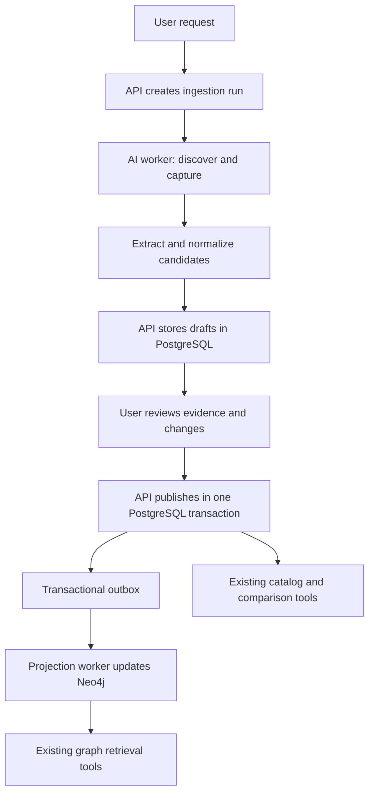

# Vehicle ingestion implementation plan

Design recorded 2026-09-06: Brazilian market, explicit model year, official
manufacturer HTML/PDF sources, and human review before publication. The first
end-to-end slice is now implemented; see [setup, behavior and current limits](vehicle-ingestion.md).
The remaining sections retain the broader roadmap and the foundation observed
before implementation. Image-based PDFs are supported using rendered page images,
added after verifying the Ranger specification table.

The intended experience is: request a vehicle or model range, discover applicable
sources, inspect extracted specifications and evidence, publish approved changes,
then use those specifications in existing comparisons and graph searches.

## Existing foundation

- PostgreSQL is authoritative; Neo4j is a rebuildable projection. See
  [data foundation](../../api/docs/data-foundation.md).
- Catalog tables already cover configurations, typed attributes, immutable source
  revisions, evidence, assertions, packages, and accepted selections.
- `catalog.specification_matrix` separates known, conflicting, and unreported
  cells. Existing retrieval selects `selectedObservationId` explicitly.
- `apps/ai/data` validates and imports curated fixtures and rebuilds the local
  graph. Its fixture-specific validator and Compose-only database adapters are
  maintenance tools, not production ingestion APIs.
- The chat agent has read-only tools. Google grounding discovers links; there is
  no source capture, draft persistence, publication command, or automatic graph sync.
- The current dataset comes from compiled notes, with useful unresolved drivetrain
  and camera conflicts. Importing primary sources must preserve that history.
- Infrastructure declares Cloud SQL, a files bucket, and Pub/Sub. The current
  subscription is pull-based; worker delivery and an outbox relay still need work.
- Production Mastra has no storage, and the AI service currently has no application
  authentication. Public write tools cannot be added to that surface unchanged.

## Ownership and execution

Mastra owns search, extraction, and typed candidate generation. Deterministic
normalizers own conversions and mappings. Spring Boot owns persisted run state,
identity resolution, validation, review decisions, and canonical publication.
The AI service does not receive unrestricted catalog SQL access. A dedicated
projection worker owns graph writes; chat graph credentials remain read-only.

Use durable API-owned stages initially. Workers claim a stage with a lease and
fencing token, submit versioned outputs through authenticated API commands, and
finish the request only after results and the next-stage outbox event are committed.
Retries reuse completed outputs. An expired worker cannot overwrite a newer attempt.
Review is a persisted state, not an open chat stream or a waiting process.

For cloud execution, extend the existing Pub/Sub infrastructure with authenticated
push delivery to a private worker deployment built from the AI code. Bound each
message to a source or document chunk, with timeouts shorter than delivery limits.
Use an outbox dispatcher that runs independently of chat requests, plus periodic
recovery of expired stage leases. Permanent failures become visible run results;
transient failures receive bounded retries and dead-letter handling. Pub/Sub
redelivers unacknowledged messages, so every stage must tolerate duplicates.
[Delivery behavior](https://docs.cloud.google.com/pubsub/docs/push).

Mastra workflows can organize bounded processing, but do not assume they survive
restarts with the current production configuration. Native suspend/resume requires
configured snapshot storage. If we later choose that execution model, use
`@mastra/pg` with a separate workflow schema in Cloud SQL and define how its state
relates to API-owned business records. Do not introduce two competing sources of
run status. [Mastra snapshots](https://mastra.ai/docs/workflows/snapshots).

## Processing stages

1. **Scope and discover.** Accept brand/model, market, model year, optional trim,
   target attributes, and optional source URLs. Search the existing catalog first.
   Resolve a model-wide request into a bounded manifest of candidate configurations.
   Prefer OEM specification pages and brochures from a maintained source registry.
   Record queries, discovered URLs, and applicability reasons. Search snippets and
   generated answers are never stored as specification evidence. Google grounding
   exposes source-link metadata; independently fetch the actual documents.
   [Grounding documentation](https://cloud.google.com/vertex-ai/generative-ai/docs/multimodal/ground-with-google-search).
2. **Capture.** Store immutable original bytes and a deterministic extracted-text
   artifact in object storage. Record requested/final URL, MIME type, retrieval time,
   hashes, HTTP validators, parser version, language, and separately evidenced
   publication date. Retain PDF page/table/column locations and HTML section locators.
   Preserve headings, table headers, legends, and footnotes in extraction context.
   Initially support HTML and text PDFs; scanned documents enter a visible
   unsupported/manual path until OCR is evaluated. Respect source access policies;
   blocked sources do not become fabricated evidence.
3. **Resolve identity.** Match model, market, model year, trim, engine, transmission,
   drivetrain, and body variant against existing records. Names and fuzzy similarity
   suggest matches; they do not authorize merges. Publication dates do not establish
   model year. Store unresolved identity candidates outside the canonical catalog.
4. **Extract.** Ask Gemini for schema-constrained claims with raw value/unit,
   proposed attribute, candidate configuration, scope, qualifiers, and evidence
   references. Split by coherent table/section rather than arbitrary text length.
   Check every excerpt against the saved text; for table claims also validate row,
   column, legend, and footnote applicability. Model output must never supply SQL,
   Cypher, arbitrary tool execution, or publication instructions.
5. **Normalize and validate.** Map approved aliases to existing attribute IDs and
   convert units using versioned deterministic rules. Preserve original notation
   and conversion details. Validate types, dimensions, identity, scope, evidence,
   and duplicates. New concepts require explicit attribute-definition review.
   Distinguish exact matches, new claims, changed values, and conflicting claims.
6. **Review and publish.** Show current value, proposed value, raw source text,
   exact location, conversion, applicability, and warnings. Reviewer decisions can
   accept selected claims, reject them, leave them pending, or explicitly record a
   conflict. Corrections create new draft revisions and require revalidation.
   Publication checks the reviewed draft hash and catalog version, then atomically
   writes canonical records, selection decisions, and the projection outbox event.
7. **Project and report.** The worker reads committed canonical data and updates
   the graph. Report publication and projection separately, so a successful import
   can say “published; graph update pending.” Failed sources and skipped attributes
   remain visible in the final coverage report.

## Normalization rules

| Case                        | Required behavior                                                                                     |
| --------------------------- | ----------------------------------------------------------------------------------------------------- |
| Torque in kgf.m             | Convert to Nm using the existing factor 9.80665; retain raw precision and RPM qualifiers.             |
| Power in cv, hp, or kW      | Distinguish units explicitly; use the attribute's canonical unit and a versioned conversion.          |
| Decimal commas and grouping | Parse using source locale and unit context; ambiguous notation needs review.                          |
| Equipment symbols           | Interpret through that source's legend; keep STANDARD, OPTIONAL, ABSENT, and NOT_APPLICABLE distinct. |
| Empty cell or dash          | Preserve as unknown unless the source explicitly defines it.                                          |
| Optional package            | Preserve package membership and conditions; do not publish as standard equipment.                     |
| Model-wide range            | Do not turn it into a trim-specific scalar.                                                           |
| Dimensions                  | Keep mirror scope, body variant, and measurement conditions separate.                                 |
| OEM capability name         | Linguistic aliasing does not establish functional equivalence.                                        |
| Conflicting sources         | Preserve both observations; no last-write-wins or model-confidence winner.                            |
| Price                       | Preserve currency, date, market, and conditions; undated data is not a current price.                 |

LLM confidence may prioritize review. It cannot replace evidence or make a claim
verified. Missing fields stay unknown; a partial crawl is not proof of absence.

## Persistence changes

Add migrations owned by the API; preserve existing immutable seed revisions.

| Proposed records                                                 | Purpose                                                                                                              |
| ---------------------------------------------------------------- | -------------------------------------------------------------------------------------------------------------------- |
| `ingestion.run`, `ingestion.stage_attempt`                       | Scope, requester, statuses, limits, leases, retries, stage outputs, parser/model/prompt versions, and usage.         |
| `ingestion.source_document`, `ingestion.source_capture`          | Stable document identity, immutable capture metadata, original/text artifact references, hashes, and fetch history.  |
| `ingestion.configuration_candidate`, `ingestion.claim_candidate` | Versioned proposed identities and claims, evidence locators, mappings, normalization results, and validation issues. |
| `ingestion.review_decision`                                      | Append-only reviewer identity, decision, reason, candidate version, and time.                                        |
| `catalog.selection_decision`                                     | Publication history with previous/new selections, actor, reason, run, and catalog revision.                          |
| `catalog.outbox_event`, projection checkpoint                    | Durable synchronization work and last applied catalog revision.                                                      |

Draft claims and unresolved vehicles must remain outside canonical catalog tables:
existing tools return observations as well as selected values. Merely adding a
PENDING flag to `spec_assertion` would risk exposing unreviewed material.

Extend source metadata with an additive link from `catalog.source_revision` to
the immutable capture and text artifact. Preserve the existing line-based evidence
contract: line numbers refer to the saved text artifact, with page/table/column
details in locators. Distinguish original-file and extracted-text hashes. Legacy
source rows remain valid without being rewritten.

Extend configuration identity status to express primary-source resolution; the
existing constraint only permits RESOLVED_FROM_NOTES and PROVISIONAL. Add identity
aliases and auditable resolution records rather than treating trim display names
as sufficient identity. Published assertions remain append-only; later corrections
append observations and update accepted selections through explicit commands.

Idempotency has separate keys: request key, document/content hash, extraction
version, candidate version, and publication key. Repeating the same import makes
no duplicate assertions or decisions. A changed document or parser can produce a
new draft without silently replacing accepted knowledge. Use a unique constraint
and row locking/version checks for concurrent identity creation and publication.

## Graph synchronization

Publication writes PostgreSQL and its outbox in one transaction. It never tries to
commit PostgreSQL and Neo4j together. Projection messages carry identity/revision
references, not model-authored graph mutations.

For the small initial catalog, serialize and coalesce projection work and adapt
the existing atomic full rebuild. Read data and a serialized catalog revision in
the same PostgreSQL snapshot. Commit the graph and its revision marker together,
then acknowledge only work covered by that revision. If the worker dies after graph
commit, a retry recognizes the marker. Newer canonical writes remain pending.

Preserve the current review-projection invalidation/reconnection behavior when
rebuilding catalog nodes. Never let a catalog rebuild leave review links marked
current when their endpoints were replaced. A Neo4j failure retains the previous
consistent projection and retries independently of publication.

Before broad batch ingestion, introduce idempotent updates for affected
configurations and dependencies, with per-entity revision guards against stale
events. Keep a full reconciliation/rebuild path. Expose projection lag and source
revision to retrieval; a stale graph must not imply that a newly published vehicle
or capability does not exist.

## API and agent experience

Proposed public authenticated commands are create run, inspect run/candidates,
review a candidate revision, publish a reviewed selection, and cancel/retry a run.
Private worker commands claim a stage and submit results; worker identity has no
permission to approve a review. Publish uses optimistic concurrency and returns a
conflict when the reviewed catalog state has changed.

Add agent tools such as `startVehicleIngestion` and `getVehicleIngestionStatus`.
Keep existing read-tool contracts intact. The agent can open the review UI, but
the publish control submits an authenticated user decision tied to exact draft
versions. Start with polling persisted status; chat disconnects cannot cancel a
durable run accidentally.

Before deploying mutation routes, implement requester/reviewer authorization,
per-run access checks, and authenticated service-to-service calls. Keep worker
routes private. Source fetchers validate DNS/IPs and every redirect, blocking
loopback, private networks, and cloud metadata addresses. Enforce byte/page/time
limits and treat every fetched document as untrusted input. These controls are
part of the fetch/write implementation, not a separate approval ceremony.

## Delivery sequence and acceptance

1. **One-source vertical slice:** submit an official URL for one configuration;
   capture, extract, normalize, review, publish, and project it. Add persistence,
   typed API boundaries, minimal review UI, and a local worker entry point.
2. **Identity and discovery:** add bounded model/trim discovery, source registry,
   catalog matching, and multi-source conflict review. Expand to the existing
   Ranger/Hilux/Frontier scope and 21 attributes.
3. **Cloud reliability:** wire private workers, push delivery, outbox dispatcher,
   lease recovery, dead letters, source artifacts, identity roles, budgets, and
   persisted progress. This is required before cloud ingestion is released.
4. **Quality and scale:** benchmark extraction across different OEM document layouts;
   add incremental graph projection, refresh scheduling, and OCR only when justified.
   Reviews, videos, embeddings, and automatic publication are separate later scopes.

The first slice is complete when the new accepted vehicle appears through the
existing catalog/specification APIs and graph capability retrieval, with exact
evidence, and rerunning it changes no canonical records. Rejected or pending
candidates must never appear in existing retrieval results.

Use a human-labeled fixture set for exact values, evidence spans, identity, and
scope. Report extraction precision and coverage separately; schema-valid JSON is
not a quality score. Add regression cases for drivetrain/camera disagreements,
optional packages, trim-specific footnotes, missing model years, and changed PDFs.
Inject worker crashes, duplicate deliveries, stale leases, simultaneous approvals,
and a graph outage to verify recovery and absence of duplicate publication.
Run the affected apps' Nx checks and real PostgreSQL/Neo4j integration suites;
the seed's local maintenance commands must remain isolated from cloud databases.

Pending product decisions: confirm market/source/review scope, choose the first
vehicle and source document, identify who may publish, and set per-run page/model
budgets. Proposed starter limits are one model/year, up to five configurations,
ten source documents, and two concurrent source tasks. These are adjustable
product limits, not claims about measured capacity.
