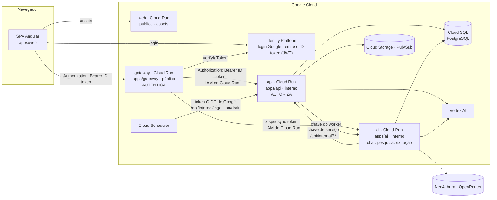
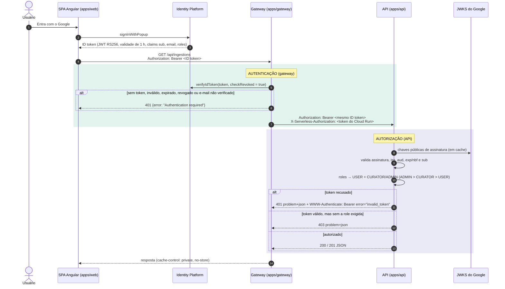

# SpecSync API

Serviço Spring Boot 4 (Java 25) que fica atrás do gateway do SpecSync. É
responsável pelo catálogo de veículos, pelas comparações, pela curadoria das
fontes ingeridas, pela ontologia, pelas pesquisas compartilhadas de veículos e
pela carteira de créditos de IA.

A solução tem dois serviços na fronteira de segurança:

| Projeto     | Caminho                        | Papel na segurança                                                 |
| ----------- | ------------------------------ | ------------------------------------------------------------------ |
| **gateway** | [`apps/gateway`](../gateway)   | **Autentica** o usuário (ID token do Identity Platform / Firebase) |
| **api**     | [`apps/api`](.) (este projeto) | **Autoriza**: valida o JWT repassado e decide o acesso pelas roles |

## Sumário

- [Guia de validação da Sprint 3](#guia-de-validação-da-sprint-3)
- [Arquitetura da solução](#arquitetura-da-solução)
- [Fluxo de autenticação e controle de acesso](#fluxo-de-autenticação-e-controle-de-acesso)
- [Como executar](#como-executar)
- [Validação de cada requisito](#validação-de-cada-requisito)
- [Endpoints](#endpoints)
- [Erros](#erros)
- [Testes](#testes)

## Guia de validação da Sprint 3

| Critério                           | Onde validar                                                                                                                                   |
| ---------------------------------- | ---------------------------------------------------------------------------------------------------------------------------------------------- |
| Arquitetura da solução             | [Arquitetura](#arquitetura-da-solução), [fluxo de auth](#fluxo-de-autenticação-e-controle-de-acesso), [requisito 1](#1-arquitetura-da-solução) |
| Autenticação e autorização         | [Requisito 2](#2-autenticação-e-autorização)                                                                                                   |
| Maturidade REST — nível 2          | [Requisito 3](#3-maturidade-rest--nível-2), [endpoints](#endpoints)                                                                            |
| Testes automatizados               | [Requisito 4](#4-testes-automatizados), [`docs/test-evidence.md`](docs/test-evidence.md)                                                       |
| JWT                                | [Requisito 5](#5-jwt)                                                                                                                          |
| Documentação e tratamento de erros | [Requisito 6](#6-documentação-e-tratamento-de-erros), [erros](#erros)                                                                          |

O caminho mais rápido para validar tudo sem credenciais do Google:

```bash
npm ci
```

```bash
npm exec -- nx run api:test
```

O segundo comando roda os 204 testes da API, incluindo todos os cenários de
autenticação, autorização, JWT, REST e erros. Depois,
[suba a API](#como-executar) e repita as chamadas `curl` de cada requisito.

## Arquitetura da solução



| Componente                                 | Responsabilidade                                                                                                                                              | Não faz                                                        |
| ------------------------------------------ | ------------------------------------------------------------------------------------------------------------------------------------------------------------- | -------------------------------------------------------------- |
| **web** ([`apps/web`](../web))             | SPA Angular; login com Google pelo SDK do Firebase; envia o ID token somente ao gateway                                                                       | Decidir permissões (as roles são só informativas na interface) |
| **gateway** ([`apps/gateway`](../gateway)) | **Autenticação**: verifica o ID token, encaminha só uma lista fechada de rotas, remove cookies e headers forjados, adiciona o token de invocação do Cloud Run | Regras de negócio e permissões                                 |
| **api** (este projeto)                     | **Autorização** e sistema de registro: catálogo, comparações, curadoria, ontologia, pesquisas, créditos                                                       | Login, senhas, emissão de tokens                               |
| **ai** ([`apps/ai`](../ai))                | Agente de chat, workers de pesquisa e extração, histórico do chat                                                                                             | Expor rotas internas ao navegador                              |

Documento completo, com todos os fluxos de serviço a serviço e a estrutura
interna da API:
[`docs/architecture/solution-architecture.md`](../../docs/architecture/solution-architecture.md).

## Fluxo de autenticação e controle de acesso



### No gateway: autenticação ([`apps/gateway`](../gateway))

1. O navegador envia `Authorization: Bearer <ID token>` para `/api/**`
   ([`src/app.ts`](../gateway/src/app.ts#L86)).
2. O gateway chama `verifyIdToken(token, true)` do Firebase Admin. Isso confere
   assinatura, expiração, audience, issuer, revogação e usuário desativado. O
   gateway também exige login com Google e e-mail verificado
   ([`src/identity.ts`](../gateway/src/identity.ts#L44)).
3. Qualquer falha gera `401` com `WWW-Authenticate: Bearer` antes que algo
   chegue à API ([`src/app.ts`](../gateway/src/app.ts#L95)).
4. Para a API, o gateway repassa o **mesmo ID token** em
   `Authorization: Bearer` ([`src/app.ts`](../gateway/src/app.ts#L127),
   [`src/proxy.ts`](../gateway/src/proxy.ts#L62)). Ele também adiciona o token
   de invocação do Cloud Run em `X-Serverless-Authorization`. Cookies, headers
   de identidade vindos do navegador e a antiga `X-Ingestion-Key` são
   descartados ([`src/proxy.ts`](../gateway/src/proxy.ts#L5)).

### Na API: autorização (este projeto)

1. O Spring Security, configurado como resource server OAuth 2.0, valida o JWT
   com as chaves públicas do Google (JWKS em cache): assinatura RS256, `iss`,
   `aud`, `exp`/`nbf` e `sub`
   ([`SecurityConfiguration.userTokenDecoder`](src/main/java/com/fiap/ford/specsync/infrastructure/configuration/SecurityConfiguration.java#L103),
   [`userTokenValidator`](src/main/java/com/fiap/ford/specsync/infrastructure/configuration/SecurityConfiguration.java#L119)).
2. As claims viram a identidade da requisição: `sub` é o principal, e `roles`
   vira `ROLE_USER` + `ROLE_CURATOR`/`ROLE_ADMIN`
   ([`userTokenConverter`](src/main/java/com/fiap/ford/specsync/infrastructure/configuration/SecurityConfiguration.java#L132),
   [`Role.fromClaims`](src/main/java/com/fiap/ford/specsync/domain/access/Role.java#L32)).
3. As regras de acesso por rota e a hierarquia `ADMIN > CURATOR > USER` decidem
   o acesso
   ([`securityFilterChain`](src/main/java/com/fiap/ford/specsync/infrastructure/configuration/SecurityConfiguration.java#L74),
   [`roleHierarchy`](src/main/java/com/fiap/ford/specsync/infrastructure/configuration/SecurityConfiguration.java#L150),
   [`IngestionConfiguration`](src/main/java/com/fiap/ford/specsync/infrastructure/configuration/IngestionConfiguration.java#L30)).
4. Falhas viram problems da RFC 9457: 401 para token ausente ou inválido, 403
   para role insuficiente
   ([`ProblemResponses`](src/main/java/com/fiap/ford/specsync/infrastructure/configuration/ProblemResponses.java#L31)).

A API não tem login, não guarda senhas e não emite tokens. A decisão e as
alternativas estão na
[ADR-0004](docs/adr/0004-gateway-authenticates-api-authorises.md).

As chamadas entre serviços não passam pelo gateway nem representam um usuário.
Elas usam credenciais de serviço conferidas por filter chains próprias: o
serviço de IA usa chaves de serviço
([`CreditsConfiguration`](src/main/java/com/fiap/ford/specsync/infrastructure/configuration/CreditsConfiguration.java#L42),
[`ResearchConfiguration`](src/main/java/com/fiap/ford/specsync/infrastructure/configuration/ResearchConfiguration.java#L33)),
e o Cloud Scheduler usa um token OIDC do Google
([`IngestionWorkerConfiguration`](src/main/java/com/fiap/ford/specsync/infrastructure/configuration/IngestionWorkerConfiguration.java#L49)).

## Como executar

Pré-requisitos: Java 25, Node 22+ e Docker.

### Só a API (suficiente para validar os requisitos)

```bash
npm ci
```

```bash
SPRING_CLOUD_GCP_CORE_ENABLED=false SPRING_CLOUD_GCP_PUBSUB_ENABLED=false SPRING_CLOUD_GCP_STORAGE_ENABLED=false GOOGLE_CLOUD_PROJECT=fiap-challenge-ford SPECSYNC_INGESTION_ENABLED=true npm exec -- nx run api:bootRun
```

- O suporte a Docker Compose do Spring Boot sobe o PostgreSQL definido em
  [`compose.yaml`](../../compose.yaml), e o Flyway aplica as migrações de
  `src/main/resources/db/migration`.
- As variáveis `SPRING_CLOUD_GCP_*_ENABLED=false` desligam os clientes do
  Google Cloud, então a API sobe sem credenciais do Google. Retire-as se você
  tiver `gcloud auth application-default login` configurado.
- `GOOGLE_CLOUD_PROJECT` (ou `SPECSYNC_AUTH_FIREBASE_PROJECT_ID`) indica o
  projeto do Identity Platform cujos tokens são aceitos. Sem essa variável,
  todo token de usuário é recusado (a API falha de forma fechada).
- A API escuta em `http://localhost:8080`. O Swagger UI fica em
  `http://localhost:8080/swagger-ui.html` e o OpenAPI em
  `http://localhost:8080/v3/api-docs`.

Recursos opcionais, configurados por variáveis de ambiente (veja
[`application.properties`](src/main/resources/application.properties)):

| Variável                                          | Habilita                                                                |
| ------------------------------------------------- | ----------------------------------------------------------------------- |
| `SPECSYNC_INGESTION_ENABLED=true`                 | endpoints de ingestão e ontologia da curadoria (sem ela, respondem 403) |
| `SPECSYNC_CREDITS_SERVICE_KEY` (≥ 32 caracteres)  | endpoints internos de créditos de IA                                    |
| `SPECSYNC_RESEARCH_SERVICE_KEY` (≥ 32 caracteres) | endpoints internos de pesquisa                                          |

### Produto completo (navegador → gateway → API/IA)

Siga [`apps/gateway/README.md`](../gateway/README.md#local-development): suba o
gateway (`nx serve gateway`, porta 3000), a API e o web (`nx serve web`) e abra
`http://localhost:4200`. O login com Google exige que a conta esteja cadastrada
como usuário de teste do app OAuth do projeto.

### Obtendo um ID token real

1. Entre no web app (local ou publicado) com o Google.
2. Nas ferramentas de desenvolvedor do navegador, abra _Session storage_ e
   procure a chave `firebase:authUser:<apiKey>:[DEFAULT]`. Copie
   `stsTokenManager.accessToken`: esse é o ID token (válido por uma hora).
3. Envie-o como bearer token, ou cole-o no **Authorize** → `userToken` do
   Swagger UI.

Para conceder a role de curador (é preciso entrar de novo depois):

```bash
node apps/gateway/ops/set-user-roles.mjs fiap-challenge-ford <uid> curator
```

## Validação de cada requisito

Os comandos `curl` abaixo foram executados contra esta branch rodando
localmente. As saídas mostradas são as respostas reais.

### 1. Arquitetura da solução

| Item                                | Onde está                                                                                                                                                                                                  |
| ----------------------------------- | ---------------------------------------------------------------------------------------------------------------------------------------------------------------------------------------------------------- |
| Diagrama de componentes             | [Arquitetura da solução](#arquitetura-da-solução) e [`docs/architecture/solution-architecture.md`](../../docs/architecture/solution-architecture.md)                                                       |
| Separação de responsabilidades      | Tabela de responsabilidades acima; arquitetura limpa da API (domain → application → infrastructure/web) em [`docs/architecture-boundaries.md`](docs/architecture-boundaries.md) e [`docs/adr/`](docs/adr/) |
| Fluxo de comunicação e autenticação | [Fluxo de autenticação e controle de acesso](#fluxo-de-autenticação-e-controle-de-acesso); fluxos de serviço a serviço no documento de arquitetura                                                         |
| Infraestrutura como código          | [`infra/environments/dev`](../../infra/environments/dev) (Terraform: Cloud Run, Cloud SQL, Scheduler, Identity Platform, Secret Manager)                                                                   |

Evidência de que a separação de camadas é respeitada: 30 regras do ArchUnit em
[`ArchitectureTest`](src/test/java/com/fiap/ford/specsync/architecture/ArchitectureTest.java),
executadas por:

```bash
npm exec -- nx run api:archTest
```

```text
archTest: 30 rules checked, 0 failed
```

### 2. Autenticação e autorização

| Perfil    | Como é concedido                  | Pode acessar                                          |
| --------- | --------------------------------- | ----------------------------------------------------- |
| anônimo   | sem token                         | leituras públicas do catálogo, Swagger/OpenAPI        |
| `USER`    | qualquer token válido             | + `GET /api/me`                                       |
| `CURATOR` | custom claim `roles: ["curator"]` | + `/api/ingestions/**`, `/api/ontology/**`            |
| `ADMIN`   | `roles: ["admin"]`                | tudo o que um curador pode (`ADMIN > CURATOR > USER`) |

- **Implementação:** autenticação em
  [`apps/gateway/src/identity.ts`](../gateway/src/identity.ts) e
  [`apps/gateway/src/app.ts`](../gateway/src/app.ts); autorização em
  [`SecurityConfiguration`](src/main/java/com/fiap/ford/specsync/infrastructure/configuration/SecurityConfiguration.java),
  [`IngestionConfiguration`](src/main/java/com/fiap/ford/specsync/infrastructure/configuration/IngestionConfiguration.java)
  e [`Role`](src/main/java/com/fiap/ford/specsync/domain/access/Role.java).
- **Evidência:**
  [`AuthorizationWebMvcTest`](src/test/java/com/fiap/ford/specsync/web/controllers/AuthorizationWebMvcTest.java)
  (grupos `PublicEndpoints`, `Authentication`, `CuratorRole`),
  [`OntologyControllerWebMvcTest`](src/test/java/com/fiap/ford/specsync/web/controllers/OntologyControllerWebMvcTest.java)
  e [`apps/gateway/src/app.spec.ts`](../gateway/src/app.spec.ts).

Endpoint público, sem token:

```bash
curl -s -o /dev/null -w "%{http_code}\n" "http://localhost:8080/api/vehicle-configurations?q=ranger"
```

```text
200
```

Endpoint protegido, sem token:

```bash
curl -s http://localhost:8080/api/me
```

```json
{
  "title": "Unauthorized",
  "status": 401,
  "detail": "A valid bearer token is required",
  "instance": "/api/me"
}
```

Endpoint de curadoria, sem token (e a antiga chave compartilhada também é recusada):

```bash
curl -s http://localhost:8080/api/ingestions
```

```json
{
  "title": "Unauthorized",
  "status": 401,
  "detail": "Curator authentication required",
  "instance": "/api/ingestions"
}
```

Endpoint interno, sem a credencial de serviço:

```bash
curl -s -X POST http://localhost:8080/api/internal/ingestion/drain
```

```json
{
  "title": "Unauthorized",
  "status": 401,
  "detail": "Ingestion trigger authentication required",
  "instance": "/api/internal/ingestion/drain"
}
```

Com um [ID token real](#obtendo-um-id-token-real): `GET /api/me` responde 200.
Uma conta sem a role de curador recebe
`403 {"detail": "The curator role is required"}` em `GET /api/ingestions`, e uma
conta com `curator` ou `admin` recebe 200. Esses três casos também são cobertos
pelos testes automatizados, com tokens assinados localmente.

### 3. Maturidade REST — nível 2

- **Recursos:** substantivos no plural sob `/api` (`/api/ingestions`,
  `/api/ingestions/{id}`, `/api/ontology/proposals`,
  `/api/vehicle-configurations`, `/api/comparisons`, `/api/me`). Os contratos
  HTTP ficam nas interfaces `*Api` em
  [`src/main/java/.../web/api`](src/main/java/com/fiap/ford/specsync/web/api).
- **Verbos:** `GET` lê e é seguro, `POST` cria ou dispara uma transição de
  estado, `PUT` substitui um sub-recurso de forma idempotente e `DELETE`
  remove. As decisões de revisão (`publish`, `reject`, `activate`) são `POST`
  em um sub-recurso de transição, porque cada uma registra uma decisão auditada
  em vez de sobrescrever o recurso.
- **Status codes:** 200 leitura, **201 + `Location`** na criação
  ([`IngestionController.create`](src/main/java/com/fiap/ford/specsync/web/controllers/IngestionController.java#L41)),
  400 requisição malformada, 401 sem token, 403 sem role, 404 rota
  inexistente, 405 método errado, 409 conflito, 422 regra de negócio violada e
  500 falha inesperada. A tabela completa por endpoint está em
  [Endpoints](#endpoints).
- **Evidência:** `createsAnImportWith201AndItsLocation`,
  `rejectsAnIncompleteBodyWith400AndTheFailedProperties`,
  `mapsABusinessRuleViolationTo422` e `answers405ForAnUnsupportedMethod` em
  [`AuthorizationWebMvcTest`](src/test/java/com/fiap/ford/specsync/web/controllers/AuthorizationWebMvcTest.java#L186).

Parâmetro obrigatório ausente:

```bash
curl -s http://localhost:8080/api/comparisons
```

```json
{
  "detail": "Required parameter 'configurationIds' is not present.",
  "instance": "/api/comparisons",
  "status": 400,
  "title": "Bad Request"
}
```

### 4. Testes automatizados

```bash
npm exec -- nx run api:test
```

```text
test: 204 tests, 204 passed, 0 failed, 0 skipped (SUCCESS)
BUILD SUCCESSFUL
```

| Cenário                                                                | Teste                                                                                                                                                                                                                                                                                                                                                                                        |
| ---------------------------------------------------------------------- | -------------------------------------------------------------------------------------------------------------------------------------------------------------------------------------------------------------------------------------------------------------------------------------------------------------------------------------------------------------------------------------------- |
| Sucesso: público 200, token válido 200, curador/admin 200, criação 201 | [`AuthorizationWebMvcTest`](src/test/java/com/fiap/ford/specsync/web/controllers/AuthorizationWebMvcTest.java), controllers em [`web/controllers`](src/test/java/com/fiap/ford/specsync/web/controllers)                                                                                                                                                                                     |
| Erro: 400, 405, 422 e 500                                              | [`AuthorizationWebMvcTest`](src/test/java/com/fiap/ford/specsync/web/controllers/AuthorizationWebMvcTest.java), [`GreetingControllerWebMvcTest`](src/test/java/com/fiap/ford/specsync/web/controllers/GreetingControllerWebMvcTest.java)                                                                                                                                                     |
| Acesso não autorizado: sem token, token inválido, sem role (401/403)   | [`AuthorizationWebMvcTest`](src/test/java/com/fiap/ford/specsync/web/controllers/AuthorizationWebMvcTest.java#L116), [`OntologyControllerWebMvcTest`](src/test/java/com/fiap/ford/specsync/web/controllers/OntologyControllerWebMvcTest.java)                                                                                                                                                |
| Credenciais de serviço: sucesso, 401, chave errada                     | [`AiCreditsControllerWebMvcTest`](src/test/java/com/fiap/ford/specsync/web/controllers/AiCreditsControllerWebMvcTest.java), [`ResearchControllerWebMvcTest`](src/test/java/com/fiap/ford/specsync/web/controllers/ResearchControllerWebMvcTest.java), [`IngestionWorkerControllerWebMvcTest`](src/test/java/com/fiap/ford/specsync/web/controllers/IngestionWorkerControllerWebMvcTest.java) |
| Gateway: 401 sem token, repasse do token como bearer à API             | [`apps/gateway/src/app.spec.ts`](../gateway/src/app.spec.ts) (`npm exec -- nx run gateway:test`)                                                                                                                                                                                                                                                                                             |

- **Evidência da execução:** o console mostra cada teste com `PASSED`/`FAILED`
  e o resumo final (configurado em [`build.gradle`](build.gradle)). O relatório
  HTML fica em `build/reports/tests/test/index.html`, e a última execução,
  com todos os 204 testes, está em
  [`docs/test-evidence.md`](docs/test-evidence.md).

### 5. JWT

- **Geração:** o JWT é o ID token emitido pelo **Identity Platform** (Firebase
  Auth) no login com Google: RS256, validade de 1 hora e as claims `sub`,
  `email`, `iss`, `aud`, `iat`, `exp` e `roles`. As roles são custom claims
  atribuídas por operadores
  ([`apps/gateway/ops/set-user-roles.mjs`](../gateway/ops/set-user-roles.mjs)).
  Nos testes, a API gera tokens com o mesmo formato, assinados com uma chave
  local ([`TestTokens`](src/test/java/com/fiap/ford/specsync/testing/TestTokens.java)),
  para exercitar o validador de produção sem acesso à rede.
- **Validação:** no gateway, `verifyIdToken`
  ([`identity.ts`](../gateway/src/identity.ts#L44)); na API, assinatura,
  issuer, audience, expiração e subject
  ([`userTokenDecoder` e `userTokenValidator`](src/main/java/com/fiap/ford/specsync/infrastructure/configuration/SecurityConfiguration.java#L103)).
- **Proteção dos recursos:** todo endpoint fora da lista pública exige o token
  ([`securityFilterChain`](src/main/java/com/fiap/ford/specsync/infrastructure/configuration/SecurityConfiguration.java#L74)).
- **Expiração:** um token expirado recebe 401 com
  `WWW-Authenticate: Bearer error="invalid_token"` e `reason` explicando o
  motivo (tolerância de 60 s de relógio). Testes: `rejectsAnExpiredToken` em
  [`UserTokenValidationTest`](src/test/java/com/fiap/ford/specsync/infrastructure/configuration/UserTokenValidationTest.java)
  e `rejectsAnExpiredTokenAsInvalid` em
  [`AuthorizationWebMvcTest`](src/test/java/com/fiap/ford/specsync/web/controllers/AuthorizationWebMvcTest.java#L116).
- **Uso das informações do token:**

  | Claim        | Uso                                                                                       |
  | ------------ | ----------------------------------------------------------------------------------------- |
  | `sub`        | principal da requisição; registrado como revisor nas decisões da curadoria e da ontologia |
  | `roles`      | authorities `USER`/`CURATOR`/`ADMIN` que decidem o acesso                                 |
  | `exp`, `iat` | janela de validade do token                                                               |
  | `iss`, `aud` | recusam tokens de outro projeto                                                           |
  | `email`      | informativo, devolvido por `GET /api/me`                                                  |

  `GET /api/me`
  ([`CallerController`](src/main/java/com/fiap/ford/specsync/web/controllers/CallerController.java))
  devolve o que a API extraiu do token:

  ```json
  {
    "uid": "…",
    "email": "…",
    "roles": ["CURATOR", "USER"],
    "expiresAt": "2026-09-27T14:03:11Z"
  }
  ```

Token malformado:

```bash
curl -s -i http://localhost:8080/api/me -H "Authorization: Bearer abc.def.ghi"
```

```text
HTTP/1.1 401
WWW-Authenticate: Bearer error="invalid_token", error_description="An error occurred while attempting to decode the Jwt: Malformed token", ...
Content-Type: application/problem+json

{"title":"Unauthorized","status":401,"detail":"A valid bearer token is required","instance":"/api/me","reason":"An error occurred while attempting to decode the Jwt: Malformed token"}
```

### 6. Documentação e tratamento de erros

- **OpenAPI/Swagger:** `http://localhost:8080/swagger-ui.html` e
  `http://localhost:8080/v3/api-docs`, com os esquemas de segurança `userToken`,
  `serviceKey` e `schedulerToken`
  ([`OpenApiConfiguration`](src/main/java/com/fiap/ford/specsync/infrastructure/configuration/OpenApiConfiguration.java)).
  As operações e respostas são documentadas nas interfaces `*Api`
  ([`web/api`](src/main/java/com/fiap/ford/specsync/web/api)). Teste:
  [`ApiDocumentationTests`](src/test/java/com/fiap/ford/specsync/ApiDocumentationTests.java).
- **Padronização dos erros:** RFC 9457 em todos os status; veja [Erros](#erros)
  ([`GlobalExceptionHandler`](src/main/java/com/fiap/ford/specsync/infrastructure/configuration/GlobalExceptionHandler.java),
  [`ProblemResponses`](src/main/java/com/fiap/ford/specsync/infrastructure/configuration/ProblemResponses.java),
  [ADR-0003](docs/adr/0003-error-handling-at-the-edge.md)).
- **README com instruções de execução:** [Como executar](#como-executar).

```bash
curl -s http://localhost:8080/v3/api-docs | python3 -c "import json,sys; print(list(json.load(sys.stdin)['components']['securitySchemes']))"
```

```text
['userToken', 'serviceKey', 'schedulerToken']
```

## Endpoints

### Públicos

| Método | Caminho                                                            | Sucesso | Erros    |
| ------ | ------------------------------------------------------------------ | ------- | -------- |
| GET    | `/api/vehicle-configurations?q=&market=&modelYear=&limit=&offset=` | 200     | 400, 422 |
| GET    | `/api/comparison-attributes`                                       | 200     | —        |
| GET    | `/api/comparisons?configurationIds=…&attributes=…`                 | 200     | 400, 422 |
| GET    | `/api/vehicle-specifications?configurationId=…`                    | 200     | 400, 422 |
| GET    | `/api/greeting?name=`                                              | 200     | 400, 422 |

### Usuário (`USER`, qualquer token válido)

| Método | Caminho   | Sucesso                                | Erros |
| ------ | --------- | -------------------------------------- | ----- |
| GET    | `/api/me` | 200 com o chamador descrito pelo token | 401   |

### Curadoria (`CURATOR` ou `ADMIN`)

| Método | Caminho                                 | Sucesso                                    | Erros              |
| ------ | --------------------------------------- | ------------------------------------------ | ------------------ |
| POST   | `/api/ingestions`                       | **201** + `Location: /api/ingestions/{id}` | 400, 401, 403, 422 |
| GET    | `/api/ingestions`                       | 200                                        | 401, 403           |
| GET    | `/api/ingestions/{id}`                  | 200                                        | 401, 403, 422      |
| GET    | `/api/ingestions/{id}/source`           | 200 `application/octet-stream`             | 401, 403, 422      |
| POST   | `/api/ingestions/{id}/publish`          | 200                                        | 400, 401, 403, 422 |
| POST   | `/api/ingestions/{id}/reject`           | 200                                        | 401, 403, 422      |
| GET    | `/api/ontology/proposals`               | 200                                        | 401, 403           |
| POST   | `/api/ontology/proposals/{id}/activate` | 200                                        | 400, 401, 403, 422 |

### Internos (credenciais de serviço)

| Método       | Caminho                                                        | Chamador        | Sucesso                               | Erros                   |
| ------------ | -------------------------------------------------------------- | --------------- | ------------------------------------- | ----------------------- |
| GET          | `/api/internal/ai-credits/wallets/{uid}`                       | IA              | 200                                   | 401                     |
| GET          | `/api/internal/ai-credits/tariffs`                             | IA              | 200                                   | 401                     |
| POST         | `/api/internal/ai-credits/wallets/{uid}/runs`                  | IA              | 200 (idempotente por run id)          | 400, 401, 402, 409, 422 |
| POST         | `/api/internal/ai-credits/wallets/{uid}/runs/{runId}/usage`    | IA              | 200 (idempotente por etapa)           | 400, 401, 404, 409      |
| POST         | `/api/internal/ai-credits/wallets/{uid}/runs/{runId}/finish`   | IA              | 200                                   | 400, 401, 404           |
| POST         | `/api/internal/research/users/{uid}/requests`                  | IA              | 200 (cria ou entra no trabalho comum) | 400, 401, 422           |
| GET          | `/api/internal/research/users/{uid}/requests[/{id}]`           | IA              | 200                                   | 401, 422                |
| DELETE       | `/api/internal/research/users/{uid}/requests/{id}`             | IA              | 200 (desvincula este usuário)         | 401, 422                |
| POST/GET/PUT | `/api/internal/research/works/{workId}/attempts/{attemptId}/…` | worker de IA    | 200                                   | 400, 401, 422           |
| POST         | `/api/internal/ingestion/drain`                                | Cloud Scheduler | 200                                   | 401                     |

Rota inexistente: 404. Método não suportado: 405. Tipo de mídia não suportado: 415. Sem token, a checagem de autenticação vem primeiro e responde 401.

## Erros

Todo erro é um problem da RFC 9457 (`application/problem+json`) com os mesmos
campos (`title`, `status`, `detail`, `instance`), venha ele do Spring Security,
da validação ou do domínio. A ausência de `type` equivale a `about:blank`,
conforme a RFC.

```json
{
  "title": "Forbidden",
  "status": 403,
  "detail": "The curator role is required",
  "instance": "/api/ingestions"
}
```

| Status          | Quando                                                                  | Campos extras                                         |
| --------------- | ----------------------------------------------------------------------- | ----------------------------------------------------- |
| 400             | Bean Validation, JSON malformado, parâmetro ausente ou inválido         | `errors: [{property, message}]` na validação do corpo |
| 401             | token ausente, inválido ou expirado; credencial de serviço errada       | `reason` e `WWW-Authenticate: Bearer`                 |
| 402             | créditos de IA insuficientes                                            | `code`, `available`, `minimumCharge`, `cheaperModels` |
| 403             | token válido sem a role exigida                                         |                                                       |
| 404 / 405 / 415 | rota inexistente, método ou mídia não suportados                        |                                                       |
| 409             | conflito de estado (execução de créditos já encerrada ou de outro dono) | `errors`                                              |
| 422             | regra de negócio violada (`DomainException`)                            | `errors`                                              |
| 500             | falha inesperada, registrada em log                                     | nenhum detalhe interno                                |

## Testes

```bash
npm exec -- nx run api:test
```

São 204 testes: testes de domínio e de casos de uso (JUnit puro), testes de
fatia dos controllers com o Spring Security real e JWTs realmente assinados,
testes de integração JDBC em H2, testes com o contexto completo e as regras de
arquitetura do ArchUnit. A última execução está em
[`docs/test-evidence.md`](docs/test-evidence.md).

Verificações rápidas (também executadas nos git hooks):

```bash
npm exec -- nx run api:spotlessCheck
```

```bash
npm exec -- nx run api:archTest
```
