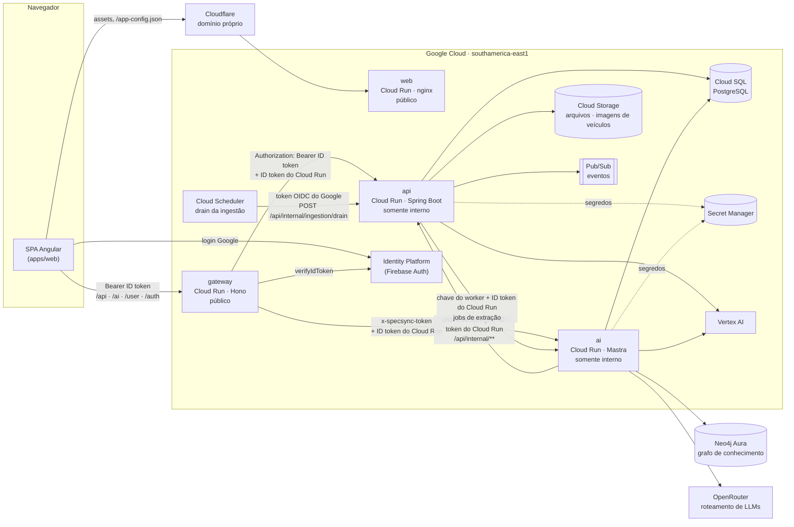
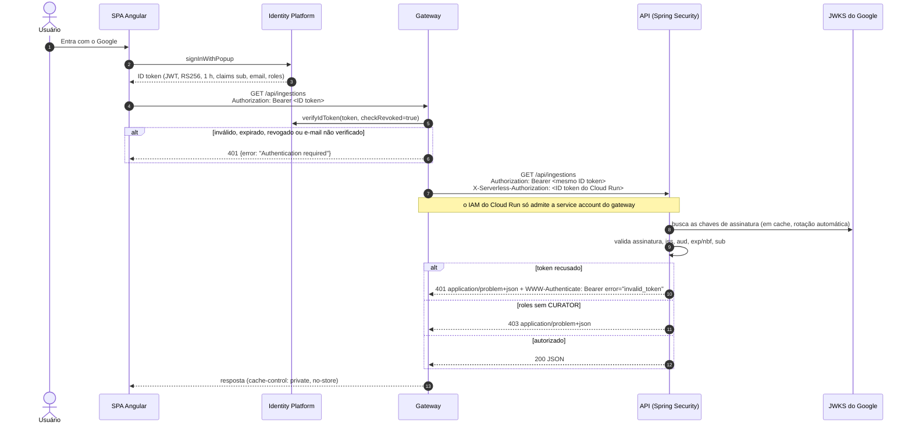
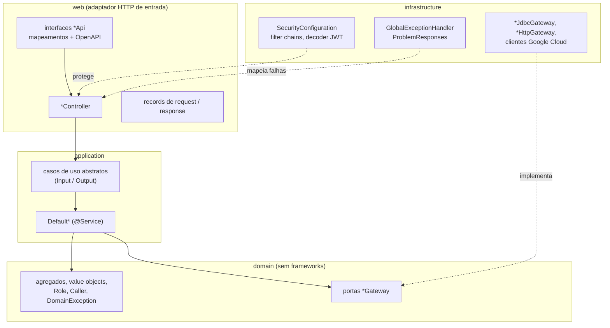

# Arquitetura da solução SpecSync

O SpecSync compara especificações de veículos com evidências das fontes. Os
usuários conversam com um chat de IA que consulta um catálogo curado, pesquisa
fontes oficiais e permite que curadores revisem o que entra no catálogo. Este
documento descreve os componentes publicados, a responsabilidade de cada um e
como as requisições são autenticadas e autorizadas. A regra central é: o
**gateway autentica** e a **API autoriza**.

## Componentes



Fontes no Terraform: `infra/environments/dev/*.tf` (`main.tf` para api, ai,
web, banco de dados, buckets e Pub/Sub; `gateway.tf` para o gateway e o
Identity Platform; `ingestion-worker.tf` para o Cloud Scheduler;
`ai-credits.tf`, `research.tf`, `openrouter.tf` e `aura.tf` para segredos e
serviços externos).

## Responsabilidades

| Componente                   | Responsabilidade                                                                                                                                                                                                                                                                                          | Não faz                                                                                                               |
| ---------------------------- | --------------------------------------------------------------------------------------------------------------------------------------------------------------------------------------------------------------------------------------------------------------------------------------------------------- | --------------------------------------------------------------------------------------------------------------------- |
| **web** (`apps/web`)         | SPA Angular e hospedagem estática. Login com Google pelo SDK do Firebase. Envia o ID token somente ao gateway.                                                                                                                                                                                            | Decidir permissões. As roles são apenas informativas na interface; o 401/403 da API define o que o usuário vê.        |
| **gateway** (`apps/gateway`) | **Autenticação.** Verifica o ID token do Identity Platform (assinatura, expiração, audience, issuer, revogação, usuário desativado, e-mail Google verificado). Encaminha uma lista fechada de caminhos para a API e a IA. Adiciona o token de invocação do Cloud Run. Aplica CORS e headers de segurança. | Conter regras de negócio ou permissões. Repassar cookies do navegador, headers de identidade forjados ou credenciais. |
| **api** (`apps/api`)         | **Autorização** e sistema de registro: catálogo, comparações, revisão de ingestões, ontologia, pesquisas compartilhadas e créditos de IA. Valida o JWT repassado e concede acesso pela claim `roles`. Arquitetura limpa (domain → application → infrastructure/web), garantida pelo ArchUnit.             | Fazer login de usuários, guardar senhas ou emitir tokens de usuário.                                                  |
| **ai** (`apps/ai`)           | Agente de chat (CopilotKit/AG-UI sobre Mastra), workers de pesquisa e extração de fontes, histórico do chat. Chama os endpoints internos da API para catálogo, pesquisa e créditos.                                                                                                                       | Expor publicamente suas rotas internas. O gateway repassa apenas o contrato do navegador.                             |
| **Cloud SQL**                | Catálogo, evidências, fila de ingestão, razão de créditos (migrações Flyway em `apps/api`) e a memória do chat da IA, com um usuário separado.                                                                                                                                                            | —                                                                                                                     |
| **Cloud Scheduler**          | Processa a fila durável de ingestão a cada minuto (08:00–23:00), para que a API possa escalar a zero.                                                                                                                                                                                                     | —                                                                                                                     |
| **Identity Platform**        | Login com Google, ID tokens e as custom claims `roles` atribuídas por operadores.                                                                                                                                                                                                                         | —                                                                                                                     |

## Autenticação e autorização

### Requisições de usuário: o gateway autentica, a API autoriza



A API valida o token de novo por dois motivos. Primeiro, o JWT é a única
credencial que ela consegue verificar criptograficamente: uma claim `roles`
forjada falha na assinatura. Segundo, qualquer outra coisa que alcance o
serviço interno, como outro workload com permissão de invocação, não consegue
se passar por um usuário. A API nunca autentica uma pessoa: não tem login, não
tem senhas e não emite tokens. Ela confere o JWT que o gateway já autenticou e
usa as claims nas decisões de acesso:

| Claim              | Uso na API                                                                                                                            |
| ------------------ | ------------------------------------------------------------------------------------------------------------------------------------- |
| `sub`              | Nome do principal: o uid do usuário. Registrado como revisor nas decisões da curadoria e nas ativações de ontologia.                  |
| `roles`            | Authorities. `curator` vira `CURATOR` e `admin` vira `ADMIN`; todo token válido também é `USER`. Valores desconhecidos são ignorados. |
| `exp`, `iat`/`nbf` | Tempo de vida do token; tokens expirados recebem 401 `invalid_token` (tolerância de 60 s).                                            |
| `iss`, `aud`       | Precisam ser `https://securetoken.google.com/<projeto>` e `<projeto>`, então tokens de outros projetos são recusados.                 |
| `email`            | Informativo, devolvido por `GET /api/me`.                                                                                             |

As roles são atribuídas por operadores, nunca pelo próprio usuário:

```sh
node apps/gateway/ops/set-user-roles.mjs fiap-challenge-ford <uid> curator
```

O script também revoga os refresh tokens do usuário, então o próximo login já
traz a nova claim.

### Perfis de acesso

| Perfil    | Como é concedido                                                                  | Pode chamar                                                      |
| --------- | --------------------------------------------------------------------------------- | ---------------------------------------------------------------- |
| Anônimo   | Sem token (só ao chamar a API diretamente; o gateway exige login em todo caminho) | Leituras `GET` do catálogo, OpenAPI/Swagger                      |
| `USER`    | Qualquer token válido                                                             | Tudo o que o anônimo pode, mais `GET /api/me`                    |
| `CURATOR` | `roles: ["curator"]`                                                              | `/api/ingestions/**`, `/api/ontology/**`                         |
| `ADMIN`   | `roles: ["admin"]`                                                                | Tudo o que um curador pode (hierarquia `ADMIN > CURATOR > USER`) |

### Chamadas entre serviços

Essas chamadas não carregam um usuário e nunca passam pelo gateway. Cada uma
passa por duas barreiras: o IAM do Cloud Run (a identidade de workload de quem
chama, em `X-Serverless-Authorization`) e uma credencial de aplicação conferida
pela filter chain dedicada da API.

```mermaid
sequenceDiagram
  autonumber
  participant S as Cloud Scheduler
  participant AI as Serviço de IA
  participant A as API

  S->>A: POST /api/internal/ingestion/drain<br/>Bearer token OIDC do Google (service account do gatilho, audience = URL da API)
  A->>A: verifica assinatura do Google, audience, e-mail = service account do gatilho
  A->>AI: POST /internal/ingestion/extract<br/>Bearer chave do worker + ID token do Cloud Run
  AI->>A: POST /api/internal/ai-credits/wallets/{uid}/runs<br/>Bearer chave de créditos + ID token do Cloud Run
  Note over AI,A: a IA verificou o ID token do usuário por conta própria;<br/>a chave torna confiável o uid do caminho
  AI->>A: PUT /api/internal/research/works/{id}/attempts/{a}/checkpoints/{key}<br/>Bearer chave de pesquisa
```

| Caminho                                  | Quem chama             | Credencial                                          | Chain                          |
| ---------------------------------------- | ---------------------- | --------------------------------------------------- | ------------------------------ |
| `/api/internal/ingestion/**`             | Cloud Scheduler        | Token OIDC do Google da service account do gatilho  | `IngestionWorkerConfiguration` |
| `/api/internal/research/**`              | Serviço de IA          | Chave de serviço de pesquisa (Secret Manager)       | `ResearchConfiguration`        |
| `/api/internal/ai-credits/**`            | Serviço de IA          | Chave de serviço de créditos (Secret Manager)       | `CreditsConfiguration`         |
| `/api/ingestions/**`, `/api/ontology/**` | Navegador, via gateway | ID token do Identity Platform com `curator`/`admin` | `IngestionConfiguration`       |
| todo o resto sob `/api`                  | Navegador, via gateway | ID token do Identity Platform                       | `SecurityConfiguration`        |

As chaves são comparadas em tempo constante sobre digests de tamanho fixo.
Todos os 401 e 403, de qualquer chain, são problems da RFC 9457.

## Por dentro da API



As dependências apontam sempre para dentro.
`apps/api/src/test/java/.../ArchitectureTest.java` garante isso com 30 regras
do ArchUnit a cada execução dos hooks (veja
`apps/api/docs/architecture-boundaries.md` e as ADRs em `apps/api/docs/adr/`).

## Documentos relacionados

- `apps/api/README.md`: como executar a API, endpoints, status codes, erros e testes
- `apps/api/docs/adr/0004-gateway-authenticates-api-authorises.md`: este desenho de segurança
- `apps/api/docs/adr/0003-error-handling-at-the-edge.md`: modelo de erros
- `apps/gateway/README.md`: autenticação, roteamento e setup local do gateway
- `apps/api/docs/test-evidence.md`: a última execução dos testes
