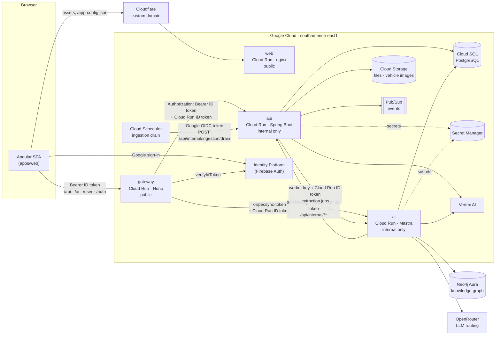
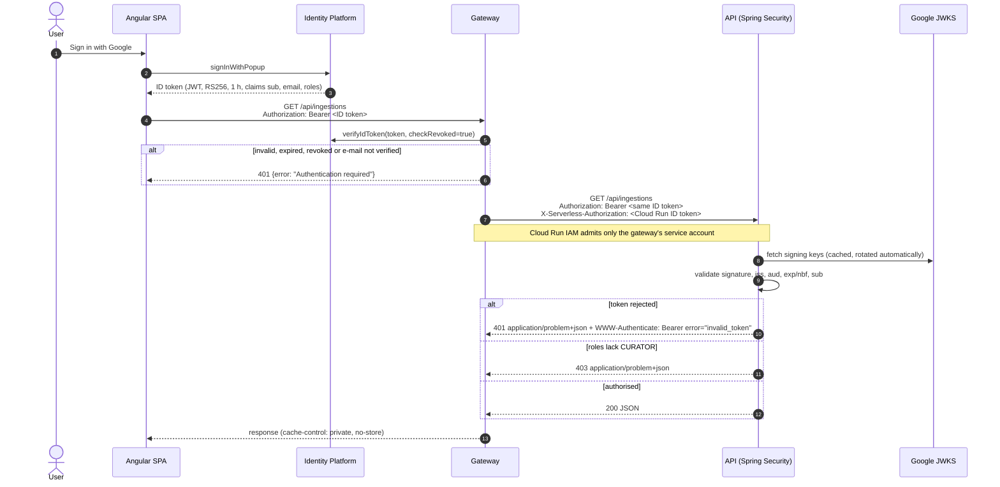
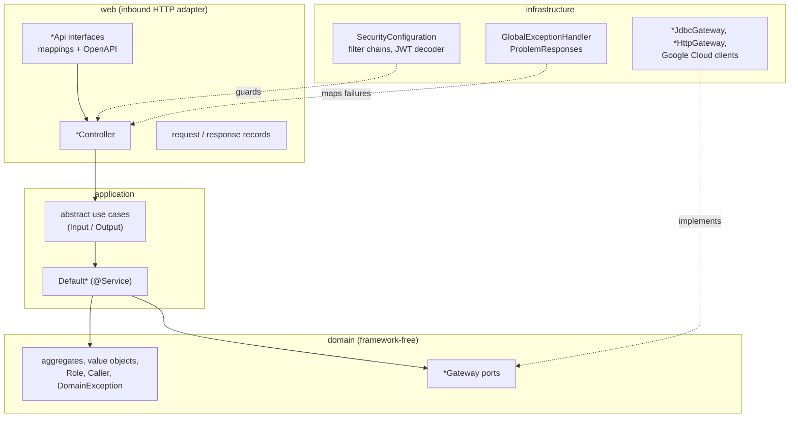

# SpecSync solution architecture

SpecSync compares vehicle specifications with source evidence. Users talk to an
AI chat that searches a curated catalog, researches official sources and lets
curators review what enters the catalog. This document covers the deployed
components, what each one is responsible for, and how requests are
authenticated and authorised. The main rule is that the **gateway
authenticates** and the **API authorises**.

## Components



Terraform sources: `infra/environments/dev/*.tf` (`main.tf` for api, ai, web,
database, buckets and Pub/Sub; `gateway.tf` for the gateway and Identity
Platform; `ingestion-worker.tf` for Cloud Scheduler; `ai-credits.tf`,
`research.tf`, `openrouter.tf` and `aura.tf` for secrets and external
services).

## Responsibilities

| Component                    | Responsibility                                                                                                                                                                                                                                                                       | Does not                                                                                             |
| ---------------------------- | ------------------------------------------------------------------------------------------------------------------------------------------------------------------------------------------------------------------------------------------------------------------------------------ | ---------------------------------------------------------------------------------------------------- |
| **web** (`apps/web`)         | Angular SPA and static hosting. Google sign-in through the Firebase SDK. Sends the ID token to the gateway only.                                                                                                                                                                     | Decide permissions. Roles are informational in the UI; the API's 401/403 drives what the user sees.  |
| **gateway** (`apps/gateway`) | **Authentication.** Verifies the Identity Platform ID token (signature, expiry, audience, issuer, revocation, disabled user, verified Google e-mail). Routes an allow-list of paths to API and AI. Adds the Cloud Run invocation token. Applies CORS and security headers.           | Hold business rules or permissions. Forward browser cookies, forged identity headers or credentials. |
| **api** (`apps/api`)         | **Authorisation** and the system of record: catalog, comparisons, ingestion review, ontology, shared research, AI credits. Validates the forwarded JWT and grants access by its `roles` claim. Clean architecture (domain → application → infrastructure/web), enforced by ArchUnit. | Log users in, store passwords or issue user tokens.                                                  |
| **ai** (`apps/ai`)           | Chat agent (CopilotKit/AG-UI on Mastra), source research and extraction workers, chat history. Calls the API's internal endpoints for catalog data, research and credits.                                                                                                            | Expose its internal routes publicly. The gateway forwards only the browser contract.                 |
| **Cloud SQL**                | Catalog, evidence, ingestion queue, credits ledger (Flyway migrations in `apps/api`), plus the AI's chat memory under a separate user.                                                                                                                                               | —                                                                                                    |
| **Cloud Scheduler**          | Drives the durable ingestion queue every minute (08:00–23:00), so the API can scale to zero.                                                                                                                                                                                         | —                                                                                                    |
| **Identity Platform**        | Google sign-in, ID tokens, operator-assigned `roles` custom claims.                                                                                                                                                                                                                  | —                                                                                                    |

## Authentication and authorisation

### User requests: the gateway authenticates, the API authorises



The API validates the token again for two reasons. First, the JWT is the only
credential it can check cryptographically: a forged `roles` claim fails the
signature. Second, anything else that can reach the internal service, such as
another workload with invoker rights, cannot impersonate a user. The API never
authenticates a person itself: it has no login, no passwords and no token
issuance. It checks the JWT that the gateway already authenticated and uses its
claims for access decisions:

| Claim              | Use in the API                                                                                                                      |
| ------------------ | ----------------------------------------------------------------------------------------------------------------------------------- |
| `sub`              | Principal name: the user's uid. Recorded as the reviewer of curator decisions and ontology activations.                             |
| `roles`            | Authorities. `curator` becomes `CURATOR` and `admin` becomes `ADMIN`; every valid token is also `USER`. Unknown values are ignored. |
| `exp`, `iat`/`nbf` | Token lifetime; expired tokens get 401 `invalid_token` (60 s clock skew).                                                           |
| `iss`, `aud`       | Must be `https://securetoken.google.com/<project>` and `<project>`, so tokens of other projects are refused.                        |
| `email`            | Informational, returned by `GET /api/me`.                                                                                           |

Roles are assigned by operators, never self-service:

```sh
node apps/gateway/ops/set-user-roles.mjs fiap-challenge-ford <uid> curator
```

The script also revokes the user's refresh tokens, so the next sign-in carries
the new claim.

### Access profiles

| Profile   | How it is granted                                                                          | May call                                                           |
| --------- | ------------------------------------------------------------------------------------------ | ------------------------------------------------------------------ |
| Anonymous | No token (only when calling the API directly; the gateway requires sign-in for every path) | `GET` catalog reads, OpenAPI/Swagger                               |
| `USER`    | Any valid token                                                                            | Everything anonymous may, plus `GET /api/me`                       |
| `CURATOR` | `roles: ["curator"]`                                                                       | `/api/ingestions/**`, `/api/ontology/**`                           |
| `ADMIN`   | `roles: ["admin"]`                                                                         | Everything a curator may (role hierarchy `ADMIN > CURATOR > USER`) |

### Service-to-service calls

These calls do not carry a user, and they never pass through the gateway. Each
one is gated twice: Cloud Run IAM (the caller's workload identity in
`X-Serverless-Authorization`) and an application credential checked by the
API's dedicated filter chain.

```mermaid
sequenceDiagram
  autonumber
  participant S as Cloud Scheduler
  participant AI as AI service
  participant A as API

  S->>A: POST /api/internal/ingestion/drain<br/>Bearer Google OIDC token (trigger service account, audience = API URL)
  A->>A: verify Google signature, audience, e-mail = trigger SA
  A->>AI: POST /internal/ingestion/extract<br/>Bearer worker key + Cloud Run ID token
  AI->>A: POST /api/internal/ai-credits/wallets/{uid}/runs<br/>Bearer credits service key + Cloud Run ID token
  Note over AI,A: The AI verified the user's ID token itself;<br/>the key makes the uid in the path trustworthy
  AI->>A: PUT /api/internal/research/works/{id}/attempts/{a}/checkpoints/{key}<br/>Bearer research service key
```

| Path                                     | Caller              | Credential                                        | Chain                          |
| ---------------------------------------- | ------------------- | ------------------------------------------------- | ------------------------------ |
| `/api/internal/ingestion/**`             | Cloud Scheduler     | Google OIDC token of the trigger service account  | `IngestionWorkerConfiguration` |
| `/api/internal/research/**`              | AI service          | Research service key (Secret Manager)             | `ResearchConfiguration`        |
| `/api/internal/ai-credits/**`            | AI service          | Credits service key (Secret Manager)              | `CreditsConfiguration`         |
| `/api/ingestions/**`, `/api/ontology/**` | Browser via gateway | Identity Platform ID token with `curator`/`admin` | `IngestionConfiguration`       |
| everything else under `/api`             | Browser via gateway | Identity Platform ID token                        | `SecurityConfiguration`        |

Keys are compared in constant time over fixed-length digests. All 401s and 403s,
from any chain, are RFC 9457 problems.

## Inside the API



Dependencies point inwards only. `apps/api/src/test/java/.../ArchitectureTest.java`
enforces this with 30 ArchUnit rules on every hook run (see
`apps/api/docs/architecture-boundaries.md` and the ADRs in `apps/api/docs/adr/`).

## Related documents

- `apps/api/README.md`: running the API, endpoints, status codes, errors, tests
- `apps/api/docs/adr/0004-gateway-authenticates-api-authorises.md`: this security design
- `apps/api/docs/adr/0003-error-handling-at-the-edge.md`: error model
- `apps/gateway/README.md`: gateway authentication, routing and local setup
- `apps/api/docs/test-evidence.md`: the latest test run
