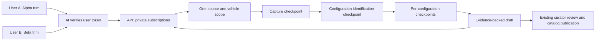

# Shared vehicle research: first implementation

This worktree now connects signed-in chat users to shared, source-scoped research.
It implements the first delivery slice of
[the harness design](specsync-search-harness-design.md). The benchmark suite remains
the starting point for comparing extraction candidates; it is not evidence of
production accuracy for every Brazilian vehicle.

## Behavior

Once discovery has resolved an official source, brand, model and model year, the
chat agent can call `researchVehicleSpecifications`. Missing or ambiguous model
years must be clarified. The API atomically creates a private subscription and
creates or joins one shared ingestion job. Several users can follow the same job
through authenticated polling without repeating its capture and extraction.



The deduplication identity includes normalized source URL, brand, model, market,
model year and operator policy version. It preserves URL path case, query order
and escapes; it removes fragments and normalizes the host/default HTTPS port.
Requested trim names stay on the private subscription and do not narrow shared
extraction. Each job therefore attempts to capture sibling configurations too.

The API joins `QUEUED`, `PROCESSING` and `REVIEW` work. Published results are reused
for 24 hours after their latest run update. A rejected, failed or stale published
job permits new work; existing subscriptions keep their original job. Reusing a
private request UUID with different input is rejected. Canceling a subscription
detaches only that request and leaves other users' work running.

## Ownership and recovery

PostgreSQL remains the only job authority. Flyway migration V9 adds the `research`
schema to the existing database; no additional service or database is provisioned.
The existing ingestion worker claims jobs using PostgreSQL row locks and a lease.
Research attempts renew their five-minute lease and use its UUID as the Mastra
run ID. Every checkpoint callback validates the current attempt and lease.

Capture, identification and completed configuration drafts are immutable
checkpoints. A replacement attempt reads them and skips those operations. Work
interrupted before a checkpoint commits can run again: this is recovery with
idempotent completed stages, not exactly-once execution of remote model calls.
An old attempt cannot replace a checkpoint or complete a newer attempt's job.

The `sharedVehicleResearch` workflow disables Mastra snapshot persistence. This
prevents generic Mastra restart recovery from competing with API lease recovery.
Mastra still orchestrates execution; durable artifacts belong to the API. Shared
work deliberately bypasses the existing process-local source-preview cache.

Policy versions must match in API and AI before extraction starts. Change
`SPECSYNC_RESEARCH_POLICY_VERSION` in both services whenever operator models,
prompts or extraction policy change. Old pending work fails closed and a new user
request uses the new scope. This first version uses operator model defaults; it
does not yet persist a fully immutable model/prompt bundle per job.

## Identity and browser contract

The browser uses these gateway paths:

| Method | Path                               | Result                                                      |
| ------ | ---------------------------------- | ----------------------------------------------------------- |
| POST   | `/ai/chat/research`                | Create or join using `{id, request}`                        |
| GET    | `/ai/chat/research`                | Latest 100 private request summaries as `{requests: [...]}` |
| GET    | `/ai/chat/research/<request UUID>` | Current private snapshot                                    |
| DELETE | `/ai/chat/research/<request UUID>` | Detached private snapshot                                   |

The gateway forwards the signed token, and AI verifies it with the existing
Firebase identity module. AI passes the verified UID to API through dedicated
service-key-authenticated internal routes. User IDs never come from tool inputs,
display headers or a model's text. Every private read and cancellation is scoped
by UID plus request UUID. Internal worker/checkpoint routes are not in the gateway
AI allowlist.

Snapshots contain stage/status, final configuration drafts, claim evidence and
validation issues, source metadata/hashes and published configuration IDs. They
exclude raw document bytes/text, lease credentials, reviewer state and other
subscribers. Configuration rows become visible after the full draft is saved;
stage progress is available before then. Extracted rows remain unreviewed until
the existing curator publication flow accepts them. Validation issues are shown
as issues, not converted to an invented probability of correctness.

The two chat tools return compact status summaries with configuration/claim
counts. The history list returns only request identity, vehicle, status, stage
and timestamps. The browser reads a full snapshot when a request is opened.
Joining a completed job therefore does not send hundreds of extracted claims
back through the chat model simply to display a card, and opening history does
not load every saved draft.

## Local setup

Keep secrets in ignored local environment files. API and AI need the same new,
random `SPECSYNC_RESEARCH_SERVICE_KEY` of at least 32 characters. Do not reuse the
credits or curator keys. Both need `SPECSYNC_RESEARCH_POLICY_VERSION=br-v1`.

The API also needs the existing ingestion worker configuration:

```text
SPECSYNC_INGESTION_ENABLED=true
SPECSYNC_INGESTION_WORKER_URL=http://127.0.0.1:4111
SPECSYNC_INGESTION_WORKER_KEY=<existing distinct worker secret>
SPECSYNC_INGESTION_REVIEWER_KEY=<existing distinct curator secret>
```

AI needs `SPECSYNC_API_URL`, its normal OpenRouter credentials, and the configured
`SPECSYNC_INGESTION_SOURCE_DOMAINS` manufacturer allowlist. Firebase/ADC and gateway
configuration are unchanged. Without the research key the new feature fails
closed. The API also refuses creation if its ingestion worker is disabled or
unconfigured.

```sh
# Start this worktree's databases, migrate, seed and project the catalog.
npm exec -- nx run ai:data-up

# In separate terminals: web + API + AI, and the gateway used by the web proxy.
npm run dev
npm exec -- nx serve gateway
```

The web app is at `http://localhost:4200`, the gateway at port 3000, the API at
8080 and Mastra Studio at 4111. `npm run dev` runs the workspace's Nx serve target;
it does not currently start the gateway. Compose assigns database ports per
worktree. Use the ports printed by `ai:data-up` for the AI memory database,
retrieval Neo4j connection and ingestion Neo4j writer in `apps/ai/.env`. The API
discovers its PostgreSQL connection through Spring Boot's Compose integration.
An ignored environment file copied from another checkout must have these local
database addresses updated before starting AI.

Mastra development and production builds currently share `.mastra/output`.
The CLI refuses a fresh build while its dev server is running. A cached Nx build
can still restore that directory and remove Studio's development assets. Stop
the dev process before running full `verify`, then restart it afterward to
restore Studio. Do not force a build over a running dev server.

## Evaluation and verification

```sh
# Pure extraction scoring and reproducible offline fixtures
npm exec -- nx run ai:benchmark-test
npm exec -- nx run ai:benchmark

# Cross-service behavior against an isolated local PostgreSQL database
# Requires the workspace Compose PostgreSQL service; builds the real API jar.
npm exec -- nx run ai:research-integration

# Existing curator extraction, publication and graph projection regression
npm exec -- nx run ai:ingestion-integration
```

When this worktree uses another checkout's running Compose services, set
`COMPOSE_PROJECT_NAME` to that existing project for these test commands. Each
integration suite creates and removes its own temporary database; it does not
migrate or reseed the application's database.

The research integration test uses synthetic evidence and a controlled HTTP
extraction worker. It tests atomic joins, private subscriptions, immutable
checkpoints, crash/restart recovery, stale attempt rejection, shared final
results, reviewed-result reuse and replacement. It does not call a paid model or
measure provider extraction accuracy. AI unit tests separately exercise skipped
checkpoint stages, extraction concurrency, abort propagation and identity.

Use the benchmark's explicit live or replay candidate modes to evaluate actual
model outputs. Promote manufacturer documents into the gold set only after human
verification of configuration identity, model year and individual evidence spans.
See [benchmark instructions](../../apps/ai/benchmarks/README.md) and the
[evaluation research](mastra-evaluations-reference.md).

## Remaining delivery work

- Discovery itself still precedes this source-scoped join. Different document
  URLs or unresolved aliases can start separate jobs for the same vehicle.
  Vehicle identity resolution and shared discovery are the next deduplication layer.
- The existing parser bounds remain: eight configurations, 24 PDF pages and 100
  claims per configuration. Results explicitly warn that complete coverage is
  not certified. Manifest pagination and continuation are needed for large files.
  The current ingestion request also limits model years to 1900–2200.
- Evidence retains hashes, excerpts, line ranges, locators and deterministic
  validation issues. Independent-source conflict resolution, calibrated
  reliability scores and human-reviewed gold coverage remain to be built.
- No paid production search/model run or production rollout is performed here.
  Source domains must be deliberately expanded for each manufacturer; supporting
  Brazil as a scope does not imply completed coverage of every type or model year.
- The API queue currently uses its existing scheduled worker. The current
  scale-to-zero/request-CPU Cloud Run configuration does not guarantee a wake-up
  after a job is queued or an instance dies. Production needs a durable dispatcher
  or an explicitly configured worker with CPU availability. The AI request timeout
  must cover the bounded 20-minute research attempt. These infrastructure changes
  are not part of this local implementation and must be resolved before rollout.
- Per-user admission limits, shared-work cost attribution, streaming partial rows,
  immutable execution bundles and a real manufacturer evaluation corpus remain
  subsequent slices of the design.
