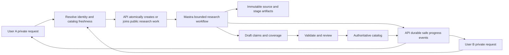

# SpecSync vehicle research harness and evaluation design

Research date: 2026-09-08. Scope: Brazil, all vehicle types and model years.
Status: design plus an executable benchmark and an initial local implementation
of shared research jobs. See [implemented behavior, setup and remaining work](shared-research-implementation.md).
No production rollout has been performed. Sections below describe the complete
target architecture; the implementation report distinguishes the delivered slice.

## Recommendation

Keep the catalog and research coordination in the API, use a bounded Mastra
workflow for reproducible evidence processing, and use agents inside that workflow
where interpreting a document or deciding the next source is useful. Give each
user a private request that can subscribe to shared public-source research.
Treat a manufacturer document as a catalog opportunity: enumerate all its
configurations, prioritize the user's configuration, and process the remainder
within a separate catalog enrichment budget.

Accuracy means an evidenced fact about the correct configuration, market, year,
and conditions. It does not mean returning a value for every field. A useful
answer may say that the year is unresolved, a specification is not reported, or
sources conflict. These states must survive extraction, publication, and chat.

Read this with the complete [Mastra harness review](mastra-harness-reference.md),
[Mastra evaluation review](mastra-evaluations-reference.md), and executable
[benchmark guide](../../apps/ai/benchmarks/README.md). The two reference reviews
inventory the entire current Harness and Evals guide navigation, plus relevant
API references. They distinguish current website guidance from core 1.64.0.

## What the repository already provides

Paths below are relative to the repository root; line numbers refer to the
checkout inspected on the research date.

| Existing capability                                                                    | Evidence                                                                                           | Consequence                                                                        |
| -------------------------------------------------------------------------------------- | -------------------------------------------------------------------------------------------------- | ---------------------------------------------------------------------------------- |
| API owns catalog truth; Neo4j is derived retrieval                                     | `apps/ai/src/mastra/agents/spec-sync-agent.ts:121`, `tools/vehicle-tools.ts:116`                   | Keep factual selection and publication out of agent memory.                        |
| Capture → identify → parallel extraction → reviewable draft                            | `apps/ai/src/mastra/ingestion/workflow.ts:133`                                                     | Extend the existing workflow instead of replacing it with an unrestricted loop.    |
| Durable SQL queue, claims, review, publication                                         | `apps/api/src/main/resources/db/migration/V5__vehicle_ingestion.sql:4`                             | Reuse PostgreSQL and API use cases for coordination.                               |
| Checksummed originals and transcripts, exact evidence excerpts, conflicting assertions | `V1__vehicle_knowledge.sql:15`, `V5__vehicle_ingestion.sql:12`, AI `ingestion/extraction.ts:52`    | Build confidence and evaluation on existing provenance.                            |
| Deterministic validation and one extraction repair                                     | `apps/ai/src/mastra/ingestion/extraction.ts:155`, `:250`                                           | Preserve bounded repair and evaluate both first-pass and repaired output.          |
| API normalization of Brazilian numbers and units                                       | `apps/api/src/main/java/com/fiap/ford/specsync/domain/ingestion/Ingestion.java:183`                | The LLM preserves raw text; domain code owns normalized values.                    |
| User-scoped Mastra memory and an existing role registry                                | `apps/ai/src/mastra/memory.ts:13`, `models.ts`, [routing contract](../openrouter-model-routing.md) | Shared catalog work uses its own pinned operator policy, while chat stays private. |

Important gaps found in code:

- A new UUID creates a new ingestion even for the same vehicle and source.
  Existing idempotency only reuses the same supplied UUID and matching owner and
  request (`IngestionJdbcGateway.java:66`).
- The source cache is a six-entry, 15-minute process-local completed-value cache.
  It does not coalesce even simultaneous same-process captures
  (`apps/ai/src/mastra/ingestion/source.ts:305–334`).
- Worker leases expire after five minutes without renewal. The worker's HTTP
  timeout is 260 seconds. Retrying calls `createRun()` afresh, without carrying the
  API run ID. Source bytes are saved only after the whole extraction succeeds
  (`IngestionJdbcGateway.java:194`, `:303`; `IngestionHttpGateway.java:28–46`;
  `apps/ai/src/mastra/ingestion/routes.ts:28`).
- PDFs currently always use vision transcription; PDFJS text helps count pages,
  rather than selecting a cheaper extraction route. The visual path allows 24
  pages, four-page batches, concurrency two, and two attempts. These are current
  limits, not evidence that a larger document was completely processed
  (`source.ts:261`; `pdf-transcription.ts:8–15`).
- Identification asks for at most eight configurations. A requested subset only
  extracts matching trims. A full numbered transcript is resent for each trim
  and repair (`identification.ts:54`, `:185`; `extraction.ts:296`).
- Citation validation against an LLM transcript cannot establish that the PDF
  was transcribed correctly, nor that a cited number belongs to the right column.
- Progress is curator polling; there is no user subscription or event cursor.
  The curator principal is the common value `curator`, not a signed-in user's UID
  (`IngestionConfiguration.java:44`; web `vehicle-ingestion-run-detail.ts:160`).
- There are strong deterministic fixture and integration tests, but no existing
  model experiment harness or calibrated confidence. The current five-config
  pickup dataset explicitly uses supplied POC notes, not manufacturer-verified
  gold (`apps/api/data/curated-pickups.json:2`).

## Domain and ownership

The following are proposed concepts and contracts, not existing tables or routes.

| Concept                 | Owner          | Identity and purpose                                                                                                                                                           |
| ----------------------- | -------------- | ------------------------------------------------------------------------------------------------------------------------------------------------------------------------------ |
| Research request        | API            | Private request ID, verified user UID, original wording, desired facts, clarification state, and subscribed work IDs.                                                          |
| Vehicle identity        | API/catalog    | Brand, model family, generation when known, BR market, model year or unresolved year, printed trim, powertrain, transmission, drivetrain, body, edition/package applicability. |
| Research work           | API            | Shared public-source scope, pinned policy, state, budget, lease, stable workflow ID, result manifest, and completion conditions.                                               |
| Subscription            | API            | Unique request/work association, authorized result projection, durable cursor, detach state. No shared chat thread.                                                            |
| Source revision         | API            | Original bytes hash, canonical URL plus redirects, capture time, publisher, publication/effective dates if stated, access scope. A URL is not an immutable identity.           |
| Document interpretation | Workflow + API | Original hash + parser/layout/prompt/model policy versions; transcript and page/table/cell anchors; extraction coverage.                                                       |
| Claim                   | API/catalog    | Configuration + attribute + raw value/unit + qualifiers + availability + evidence + review status + confidence policy. Multiple claims may disagree.                           |
| Run event               | API            | Work ID, monotonically increasing sequence, safe status/result references, event schema version.                                                                               |

Preserve catalog UUIDs. Extend identity and aliases incrementally; do not replace
the existing configuration UUID with a concatenated natural-language string.
Distinguish manufacturing year, model year, brochure publication date, and date
of capture. Unknown years are unresolved identities, not wildcards joining every
year. Prices require date, region, and conditions and must not inherit a vehicle's
timeless technical-specification freshness policy.

For “ranger limited v3 edition”, query catalog aliases and use grounded identity
candidates. `v3` might be an edition, typo, or powertrain description: do not
silently reinterpret it as V6. Ask for the discriminating year/engine when needed,
while independent model-family source discovery may proceed. Return separate
results for a multi-vehicle request, including partial successes.

Use the existing API clean-architecture rings and the current vehicles/chat web
domains. UI reads go client → store → smart component; a coordinator combines
state. This proposal requires neither a new web domain nor weaker architecture
rules. See [API boundaries](../../apps/api/docs/architecture-boundaries.md) and
[web state rules](../../apps/web/docs/architecture-state-management.md).

## Shared work and delivery

### Three deduplication boundaries

1. **Research scope:** after identity resolution, use a versioned key over market,
   model/generation, confirmed year or explicit unresolved scope, access class,
   and compatible research policy. Trim-specific requests may join broader
   model/year work when its manifest covers the requested trim and attributes.
   Preserve a narrower request's acceptance criteria independently.
2. **Capture:** normalize safe URL components and use a shared source-capture
   lease before downloading. Do not discard meaningful query parameters. After
   download, content hash unifies mirrors and revised URLs. Before discovering
   equivalent URLs, some duplicated network discovery is unavoidable; content
   hashing prevents duplicate downstream interpretation.
3. **Interpretation/extraction:** key artifacts by original hash, parser/layout
   version, extraction schema, prompt/model bundle, and applicable configuration
   scope. A model change is a distinct experiment, not a cache hit. Raw capture
   remains reusable across model experiments; generated transcripts may not.

Implement create-or-join with a database transaction and a uniqueness constraint
on active compatible work. Avoid check-then-insert without the constraint. In the
same transaction, upsert the subscription and persist dispatch intent. A claim
worker acquires a lease through an atomic conditional update, with monotonically
increasing fencing token and expiry. Heartbeats and every result/event write must
check that token. A stale worker cannot complete or publish after replacement.

If a later subscriber needs more coverage, add child work for the missing scope;
do not mutate inputs of a running workflow. Larger priority does not change its
model bundle. Refreshes create a new source revision; stale published evidence can
be served with an explicit date while refresh runs. Negative results use shorter
freshness windows and distinguish unavailable/blocked sources from “not reported”.

### Durability is more than a persisted run

Persist a stable API work ID and its mapping to attempt-specific Mastra run IDs.
Save source
capture, document manifest, and individual configuration results after their
respective steps, not only at final completion. Resume only compatible versioned
work; changed workflow definitions need an explicit migration or new work ID.

Choose exactly one owner for dispatch/recovery. The initial recommendation is the
API queue with durable stage artifacts and checkpointed Mastra workflow attempts.
Do not independently enable automatic durable-agent recovery or generic workflow
boot recovery against the same work. Core also exposes
`restartAllActiveWorkflowRuns`; ensure the deployed server's separate workflow
restart path is disabled, excluded, or routed through API lease admission for
these jobs. Verify that behavior against the generated server, not just the
durable-agent configuration.

Result fencing alone cannot stop an old process from overwriting Mastra snapshots
for a reused run ID. A replacement lease epoch therefore gets a new attempt run
ID and consumes completed API-owned stage artifacts; preserve the old run for
diagnostics. Resume the same framework run only when its execution ownership and
snapshot writes are demonstrably exclusive. Check API ownership before every
expensive invocation and after it, while recognizing that an already-started
provider request may outlive its lease. Crash recovery is
at-least-once: an external model call might finish just before the durable write.
Keep provider invocation records, retries and cost attribution, but do not claim
exactly-once external inference. Publication and stored stage outputs can still
be idempotent.

Cloud Run scale-to-zero requires a deployment-specific wakeup/dispatch mechanism.
The current in-process scheduled poller is not proof that queued work will wake a
zero-instance service. Before rollout, test a request-bound dispatcher that keeps
the execution request active, an explicitly provisioned worker, or an external
durable dispatcher. Persist dispatch intent first so a delivery failure is
recoverable. A new queue/service is an infrastructure decision; none is provisioned
by this benchmark change. [Cloud Run background work guidance](https://docs.cloud.google.com/run/docs/tips/general#avoid_background_activities)

Mastra durable-agent stream observation and workflow execution are different
layers. Core 1.64.0 has backend-dependent recovery leases; a no-op lease fallback
is not distributed coordination. The docs also contain conflicting recovery and
cleanup descriptions. Pin the version and prove behavior under concurrent
observers and process crashes before using it as a public transport.
[Durable agents](https://mastra.ai/docs/harness/durable-agents),
[DurableAgent reference](https://mastra.ai/reference/agents/durable-agent)

### Subscriber contract

Proposed routes are `POST /api/research/requests`,
`GET /api/research/requests/:id`, a cursor-based events read under that request,
and a detach/cancel-request operation. Authenticate and authorize every route with
the verified UID; a leaked shared work ID grants no access. Existing curator-key
routes cannot provide this policy by themselves.

The create response atomically indicates `catalog-hit`, `joined`, `queued`, or
`needs-clarification`, and includes an authorized snapshot and cursor. Persist
events before live delivery. Because one request can join several work IDs, its
cursor is an opaque, server-validated map of work ID to sequence plus subscription
revision. Replay each work's events after its own position; atomically include
new child subscriptions and their initial positions when the revision changes.
Never compare one work's sequence to another work's scalar cursor. For SSE, join
replay to live delivery without a gap; for an expired cursor, send a fresh snapshot
and replacement cursor. A polling adapter against the same persisted events is an
acceptable first transport and avoids adding a pub/sub store.

One user disconnecting, logging out, or cancelling detaches only that subscription.
It must not abort a job another user needs or destroy shared replay data. The API
work policy decides whether unsubscribed catalog enrichment continues. Expose
configuration discoveries, verified draft progress, coverage limits, and published
results; never replay raw prompts, model reasoning, credentials, user preferences,
wallet information, or another user's chat messages.

An authenticated reconnect reads its persisted subscriptions on another replica.
Keep private response generation in each user's existing Mastra memory thread.
Show research drafts with an explicit unreviewed status; accepted catalog facts
continue through the existing review/publication gate.

## Research and extraction workflow

| Stage          | Deterministic responsibility                                                               | Agent/LLM responsibility                                      | Durable output                                           |
| -------------- | ------------------------------------------------------------------------------------------ | ------------------------------------------------------------- | -------------------------------------------------------- |
| Resolve        | Catalog exact IDs/aliases, year/market checks, attribute lookup                            | Propose identity candidates and minimal clarification         | Resolution with evidence and unresolved alternatives     |
| Discover       | Catalog/source index, allowlisted fetch, URL normalization, content-type checks            | Bounded official-source discovery and gap-specific follow-up  | Candidate sources and rejection reasons                  |
| Capture        | Existing SSRF/size/time defenses, immutable bytes, checksums, revision matching            | None by default                                               | Source revision, fetch metadata                          |
| Read layout    | PDF embedded text, HTML tables, page/cell anchors and quality diagnostics                  | Vision on scanned/uncertain pages or table regions            | Versioned transcript/layout tied to original bytes       |
| Enumerate      | Deduplicate printed identities; retain document boundaries                                 | Identify all trims/powertrains/body variants and legends      | Full configuration manifest and unresolved mappings      |
| Extract        | Route relevant table/section/footnote chunks; bounded concurrency                          | Structured claims with exact raw values and applicability     | Per-configuration candidate claims                       |
| Verify         | Schema, units, bounds, anchors, identity, column, legend, qualifiers, contradiction checks | Independent semantic verification for uncertain claims        | Accepted candidates, rejected claims and issues          |
| Reconcile      | Group compatible claims, preserve conflicts and source dependence                          | Targeted second-source search for high-value unresolved facts | Claim set, confidence features, missing-coverage reasons |
| Review/publish | Existing API invariants, review hash, revision check, idempotent publication               | Explain evidence and remaining limitations                    | Catalog revisions and derived projection updates         |

A discovery agent gets bounded tools for search, fetch requests, and source-index
lookup. Extractors and semantic verifiers get supplied evidence and structured
schemas, without tools for arbitrary publication. Source text remains untrusted
data. Reuse existing fetch protections; content saying to ignore instructions or
call another URL does not grant a new capability.

### Full-document catalog expansion

Separate the **document manifest** from each extraction batch. Enumerate all
configurations across pages first and record a count, page coverage, identity
evidence and continuation marker. Process batches within the existing eight-config
limit until the manifest is exhausted. Do not silently drop configuration nine.
Similarly, page 25 must produce continuation or an explicit coverage limitation,
not a claim that a PDF is complete. Never truncate before recording what remains.

Process the requested trim first and make its verified draft available early.
Extract siblings in a separately bounded background budget; share model-wide
observations only when source applicability explicitly supports them. Follow
referenced annexes and linked specification documents through the same work keys.
Record document-level, configuration-level, and attribute-level coverage; user
request completion and whole-document completion are separate states.

For Brazil-wide scope, attributes must be discoverable by vehicle class. Motorcycles,
buses, heavy trucks, passenger cars, hybrids and EVs need different applicable
attributes. Unknown attribute proposals go to schema review rather than being
discarded or invented as arbitrary catalog codes. “Not applicable” requires known
applicability; it must not be inferred just because a value is missing.

### Efficient hybrid reading

Compare these policies on the same frozen documents:

- Existing baseline: all-page vision → identification → per-trim extraction and repair.
- Deterministic layout/text → LLM identification and structured extraction.
- Adaptive reading: deterministic layout where trustworthy, targeted vision for
  low-quality/rotated/scanned/merged-cell regions, then shared extraction.
- LLM document/table extraction producing multiple configurations in a single
  pass, followed by deterministic validation and targeted independent verification.

Preserve table headers, row labels, footnotes, page boundaries and bounding boxes
through every path. Chunk by semantic table/section, not arbitrary character
counts. A chunk must carry enough identity/legend context to assign its claims.
Cache immutable intermediate artifacts; do not rerender a whole PDF for every
trim. Use parallelism limited by provider rate, memory and per-work budget, with
bounded transient retries and at most a configured number of repair rounds.

Set stop conditions before dispatch: maximum searches, URLs, bytes/pages, model
calls, tokens, time, retries and sibling work. Stop when the requested coverage is
satisfied, remaining gaps have no admissible source, or a budget is exhausted.
Record why each missing field remains unresolved. More LLM passes are a candidate
policy to measure, not an assumption that accuracy improves.

## Provenance and confidence

Each claim should retain the source original hash and revision, upstream URL,
publisher, captured/published dates, parser version, transcript hash, page/table/
row/column or bounding box, exact excerpt, raw value and unit, normalization rule,
identity/market/year applicability, qualifiers, model bundle/prompt version,
verification results, and review history.

Separate these dimensions:

| Dimension                | Meaning                                                                                                                 |
| ------------------------ | ----------------------------------------------------------------------------------------------------------------------- |
| Source authority         | Who published it; first-party technical brochure versus dealer copy or curated notes. Not a probability of correctness. |
| Reading integrity        | Whether the original bytes/pixels support the retained transcript and cell.                                             |
| Identity/applicability   | Whether the claim applies to the exact trim, market, model year, engine, body, package and conditions.                  |
| Extraction/normalization | Whether the value, unit, legend and transformation were interpreted correctly.                                          |
| Corroboration            | Agreement from independent sources; mirrors of one brochure count as one evidence family.                               |
| Confidence               | A versioned calibrated estimate that a claim is correct, where calibration data exist.                                  |

Initially expose evidence-backed status and confidence components, with numeric
confidence **unknown**. Do not relabel an LLM's self-score or a weighted authority
heuristic as “95% reliable”. Once human labels exist, calibrate a predictor on a
separate calibration split and evaluate Brier score, reliability bins and
risk-versus-coverage curves on held-out data. Use class-aware calibration where
there is enough data; report uncertainty for small or unseen strata.

`KNOWN`, `NOT_REPORTED`, `CONFLICTING`, availability and review state remain
independent from confidence. Two conflicting high-authority sources remain a
conflict until applicability or a superseding revision resolves it. Agreement
between two LLMs reading the same mistaken transcript is not independent evidence.

## Evaluation process

### Five evaluation layers

1. **Deterministic contracts:** pure schema/evidence/unit/identity checks, missing
   predictions, duplicate predictions, malformed outputs, budget boundaries and
   scoring regressions. Run on every relevant change without credentials.
2. **Frozen extraction:** original documents plus adjudicated gold, fixed tool
   responses and isolated catalog snapshots. Compare reading policies, extraction
   policies and model bundles independently.
3. **End-to-end search:** frozen search results and linked source graphs from a
   fresh catalog, plus a separate warm-catalog track. Evaluate discovery recall,
   identity clarification, requested facts and full-document expansion.
4. **Service integration:** real PostgreSQL ownership/leases/subscriptions and
   process interruption; mock model tools with counted invocations. Verify shared
   execution, replay, isolation and idempotent writes independently of answer quality.
5. **Live audits:** time-stamped real-web runs and stratified reviewed production
   samples. Report separately because search indexes, sites and models change.

Mastra custom scorers can be deterministic; built-in relevance/faithfulness
scorers are supplementary diagnostics, not substitutes for vehicle fact matching.
Core 1.64.0 provides `createScorer` and direct `scorer.run`, so the initial harness
needs no new eval dependency. The fuller integration can use `runEvals` for
Agent/Workflow targets and datasets/experiments for stored comparisons.
[Custom scorers](https://mastra.ai/docs/evals/custom-scorers),
[Running in CI](https://mastra.ai/docs/evals/running-in-ci)

Live scorers run asynchronously; an asynchronous score is not a synchronous
publication guard. Essential domain checks belong on the write path. Score a
stratified sample for diagnostics and a separate risk-focused sample for triage;
do not report their mixture as unbiased overall quality.
[Evaluation overview](https://mastra.ai/docs/evals/overview)

### Dataset and gold protocol

Build a manifest spanning BR vehicle classes, brands, generations, model years,
fuel/powertrain types, and document formats. Include older discontinued vehicles,
undated brochures, model-year transitions, scanned PDFs, tables with repeated or
merged headers, optional packages, flex-fuel values, metric conversions, price
dates, absent legends, conflicting sources, multiple user vehicles and ambiguous
names. Record unsupported classes/years rather than implying comprehensive coverage.

Start with roughly 60–100 independently sourced document families, selected for
these strata, then expand based on observed failures. This is a proposed collection
budget, not sufficient evidence for a particular accuracy claim. Freeze original
bytes and search responses, hashes, attribution, capture date, source-family ID,
labeler/adjudicator, schema version and known omissions. Label the original
PDF/page/table, not the model-generated transcript.

Two reviewers label identity, all manifest configurations, applicable attributes,
raw/normalized values, qualifiers, availability, evidence anchors and missing or
conflicting cases. Adjudicate disagreements; uncertain labels stay excluded from
hard factual gates with explicit counts. Assign train/development, calibration and
held-out test splits by source family/model generation, keeping mirrors, revisions,
translations, crops and all trims of a brochure together. Include a later-date
holdout for drift. Protect gold from candidate prompts and model judges unless
the scorer explicitly requires it.

The current curated POC notes can seed regression tests but cannot become
manufacturer gold without reviewing original sources. The new synthetic fixtures
test scorer behavior only. Neither corpus establishes all-Brazil model accuracy.

### Metrics and promotion

| Metric                              | Measurement                                                                                                                                                                        |
| ----------------------------------- | ---------------------------------------------------------------------------------------------------------------------------------------------------------------------------------- |
| Identity accuracy and clarification | Correct entity/market/year/powertrain; correct abstention or clarification on unresolved queries.                                                                                  |
| Claim precision and recall          | One-to-one matching of configuration, attribute, value, unit, qualifiers and availability; false claims lower precision, omissions lower recall.                                   |
| Evidence accuracy                   | Correct revision and original anchor, applicable row/column and header/legend; text occurrence alone is insufficient.                                                              |
| Variant coverage                    | Recovered complete document manifest; fabricated and omitted variants counted separately.                                                                                          |
| Conflict/missingness                | Preservation of conflicting observations; missing/absent/not-applicable distinguished.                                                                                             |
| Confidence calibration              | Brier score, reliability plot, calibration sample count and high-confidence error rate. Unknown confidence stays missing.                                                          |
| Efficiency                          | First useful evidenced result and final completion p50/p95, provider calls, input/output/reasoning/cached tokens, pages processed, retries, actual cost and cost per correct fact. |
| Sharing/recovery                    | Duplicate expensive invocations, one active owner per key, stale writes rejected, event replay without loss, unauthorized observations rejected.                                   |

Use attribute-specific numerical normalization/tolerances rather than blanket
string similarity. Never compare engine horsepower across different fuel/RPM
conditions as one fact. A null prediction cannot improve coverage by becoming
zero; duplicate claims cannot improve recall. Report per-case and per-stratum
results as well as macro and micro aggregates, including all timeouts/errors.

Pin dataset hash, candidate revision, dependency lock hash, model bundle, prompts,
schemas, routing/fallback settings, temperature/effort/output limits, cache policy,
tool fixtures, repetitions and hardware/concurrency in each experiment. Repeated
trials share the same cases; randomize/interleave live candidate ordering. Use
paired differences and document-family bootstrap intervals once the dataset is
large enough. Do not select a winner on one pass or only an average quality score.

Suggested promotion policy, to validate against reviewed baseline data:

- No identity crossover, invalid source anchor, unsupported high-confidence
  safety claim, unauthorized shared result, or stale-owner publication in the
  corresponding adversarial regression suite.
- At least 99% claim precision and 95% applicable claim/variant recall on the
  adjudicated benchmark, with no material regression per sufficiently sampled
  stratum. These are proposed targets, not measured current performance.
- Compare cost and latency only among candidates passing the quality gates.
  Set actual service SLOs from measured baselines; no current measurement supports
  a specific latency/cost promise.
- Any missing required scorer, malformed report, provider error, non-finite
  score or failed required case fails the run. With Mastra gates, require an
  explicit `passed` verdict: a threshold miss can be `scored`, not `failed`.
  [Gates and verdicts](https://mastra.ai/docs/evals/gates-and-verdicts)

### Concurrency and failure scenarios to implement

| Scenario                                                                    | Acceptance criterion                                                                                     |
| --------------------------------------------------------------------------- | -------------------------------------------------------------------------------------------------------- |
| Two users request aliases of the same confirmed vehicle simultaneously      | One active compatible research work; both get private subscriptions.                                     |
| A requested trim is a subset of an active brochure import                   | Join that work and prioritize its results; no repeat document reading.                                   |
| Same URL on two replicas; two URLs resolve to identical bytes               | Capture ownership for known URL; content-hash reuse for interpretation across aliases.                   |
| Another market/year or private uploaded document                            | Never shares incompatible applicability or private source content.                                       |
| User A disconnects while B observes                                         | B continues; A can reconnect with cursor; no shared cleanup triggered.                                   |
| Crash after capture, mid-extraction, or immediately before completion write | Resume from durable stages; expired owner cannot commit; repeated external calls are visible in metrics. |
| Lease expiry, delayed heartbeat and concurrent recovery                     | At most one current fenced owner; stale results/events rejected.                                         |
| Commit succeeds but response is lost                                        | Retried publication returns same catalog revision; no second charge or duplicated claim.                 |
| Scale to zero with queued work                                              | Durable dispatch wakes processing; no job depends on an absent in-process timer.                         |
| Ninth configuration or twenty-fifth PDF page                                | Continuation or explicit incompleteness, never silent full-coverage success.                             |

The initial benchmark does not simulate these tests and call them distributed
proof. They require the API/worker integration work below.

## Billing and operational policy

Recommended policy: shared public catalog enrichment uses SpecSync's operating
budget; private answer generation uses the user's normal wallet. Charge a provider
call once to its owning job, never once per subscriber. Persist idempotent usage
events and settle them through the existing API ledger. A user joining a completed
capture owes no transcription charge for a call that did not occur.

This is a proposal extending the existing operator-owned curator workflow. If the
product instead funds user-triggered research through a sponsor wallet, specify
admission, cancellation and sponsorship explicitly before rollout. Neither policy
may be enforced only through an in-memory callback: a resumed workflow must retain
the same budget and model bundle. Keep evaluator model costs separate from
candidate costs, and unreported costs unknown rather than free.

## Delivery sequence

1. **This change:** documentation and offline/replay/explicit model benchmark
   foundation, strict scorers, failure cases, Nx commands and report artifacts.
   See the benchmark guide for implemented scope and commands.
2. **Baseline adapters and gold:** expose the current capture/identify/extract
   stages to fixture-backed workflow candidates without changing prompts; capture
   real original documents and adjudicate labels. Add measurements for every
   production role, repair, page, retry and provider usage event.
3. **Shared work foundation:** API request/work/subscription types and migrations,
   verified UID access, atomic create-or-join, work-to-attempt IDs, persisted dispatch,
   renewable leases/fencing and per-stage checkpoints. Test across processes.
4. **User delivery:** authorized snapshots and durable cursor polling, then SSE
   if worthwhile; private chat adapters render safe incremental research results.
   Preserve separate curator publication privileges.
5. **Catalog expansion and reading experiments:** full-document manifests,
   continuation, targeted reading, bounded sibling enrichment and independent
   claim verification. Compare against the frozen baseline before switching defaults.
6. **Confidence and promotion:** human labels, calibration, explicit quality gates,
   sampled live diagnostics, regression corpus growth and model policy promotion.

Open product decisions for implementation are the enrichment budget/SLO, supported
source acquisition policy for difficult historical documents, and whether verified
drafts should ever auto-publish. The recommended first release keeps human review,
adds no persistent service, and makes quality improvements measurable before
changing production behavior.
